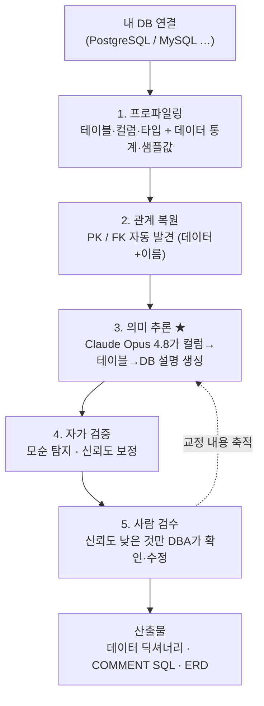
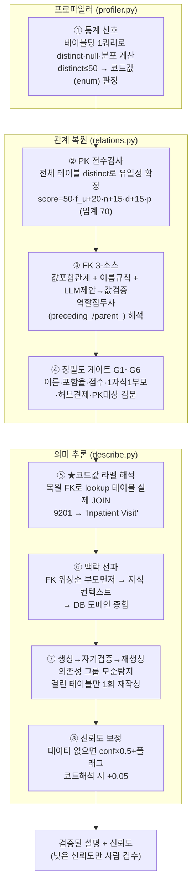

# db2doc — 문서 없는 DB를 자동으로 "설명"해 주는 도구

> **한 줄 요약**: 스키마 정의서·주석·ERD가 **하나도 없는** 데이터베이스를 받아서,
> **테이블/컬럼 이름과 실제 데이터만 보고** "이 테이블/컬럼이 무엇인지"를 사람이 읽을 수 있는
> 문장으로 **자동 복원**하고, 사람이 검수·수정해 **살아있는 데이터 카탈로그(메타스토어)**로 만든다.

DBA가 처음 보는 DB를 받았을 때 하는 일 — *데이터 좀 떠보고, 키·조인 관계 파악하고, "아 이 테이블은
환자 진단 기록이구나" 결론 내리는 것* — 을 자동화한다. 100% 자동이 아니라 **AI가 초안을 만들고
DBA가 검수**하는 구조다.


---

## 어떻게 돌아가나 (전체 흐름)



핵심 원칙: **데이터로 확인되는 것만 자신 있게 말하고, 확인 못 한 건 솔직히 "낮은 신뢰도"로 표시**해
사람이 검수하게 한다. 그래서 틀린 설명을 그럴듯하게 우기는 일(hallucination)을 막는다.

---

## 무엇을 복원하나 — 실제 예시

문서가 0인 상태에서, `person.gender_concept_id` 컬럼 하나를 보자.

**입력 (시스템이 데이터에서 모은 단서):**
| 단서 | 값 | 의미 |
|---|---|---|
| 컬럼명 | `gender_concept_id` | "성별 + 개념 ID" |
| 고유값 비율 | 0.002 | 거의 안 변함 → **코드값(enum)** 신호 |
| 가장 흔한 값 | `8532`(511건), `8507`(489건) | 딱 2종, 반반 → 이진 범주 |
| 복원된 관계 | → `concept.concept_id` | 표준 개념 테이블을 가리키는 FK |

**출력 (AI가 생성한 설명):**
> *"성별을 나타내는 표준 개념 ID이며 concept 테이블을 참조하는 외래키. 데이터상 값은 두 종류로,
> 성별 코드로 보인다."* (신뢰도 0.9+)

→ 이름·통계·관계 세 단서를 합쳐 **"성별 코드이고 concept를 가리킨다"**까지 데이터 근거로 추론한다.
(단, "8507이 정확히 무엇인지"처럼 데이터에 매핑이 없는 부분은 단정하지 않고 검수로 넘긴다.)

---

## 단계별 상세

| 단계 | 하는 일 | 결과물 |
|---|---|---|
| **1. 프로파일링** | `information_schema`에서 테이블/컬럼/타입 + 컬럼별 통계(고유값·null·min/max·top-k 분포) + 테이블당 ≤1000행 샘플 | 구조화된 프로파일 |
| **2. 관계 복원** | PK·FK를 **데이터로** 발견: 자식 컬럼 값이 부모 키에 다 들어있으면 FK(값 포함관계). 데이터 없는 빈 테이블은 **이름 규칙**으로 보강. 선언된 키가 있으면 그대로 채택 | PK/FK + 신뢰도·근거 |
| **3. 의미 추론 ★** | Claude Opus 4.8에 단서를 주고 **컬럼→테이블→DB** 순으로 설명 생성. enum 해석·hallucination 방지·보수적 신뢰도를 지시 | db/table/column 설명 + 신뢰도 |
| **4. 자가 검증** | 설명들 간 모순 탐지(예: FK 방향 오추론), 데이터로 검증 못 한 항목은 신뢰도 강등 | 검증·보정된 설명 |
| **5. 사람 검수** | 신뢰도 **낮은 것만** 추려 DBA가 확인/수정/승인. 모든 변경은 이력(감사) 기록 | 확정된 설명 |
| **산출물** | 데이터 딕셔너리(Markdown) · `COMMENT ON` SQL(DB에 주석 반영) · CSV · Mermaid ERD | 문서 |

> 이 5단계는 **여러 DBMS**(PostgreSQL·MySQL 등)에서 동일하게 동작한다(SQLAlchemy 추상화).

---

## description 생성 8가지 기법 (코드베이스 기반 정리)

문서 없는 DB에서 의미를 복원하는 핵심 기법들. 관통 원칙은 **"데이터로 확인되는 것만
자신 있게 말하고, 확인 못 한 건 낮은 신뢰도로 표시한다"**(환각 방지). 아래는 v2 구현
(`v2/profiler.py`, `v2/relations.py`, `v2/describe.py`) 기준이며, 동작 방식·실제 예시는
[`v2/SOLUTION.md`](v2/SOLUTION.md), 논문 근거는 [`v2/GUIDE.md`](v2/GUIDE.md) 참조.



| # | 기법 | 코드에서 어떻게 (핵심 상수·수식) | 단계 |
|---|---|---|---|
| ① | **통계 신호로 컬럼 성격 판별** | `bulk_stats`가 **테이블당 단일 집계쿼리**로 표본(≤1000행)의 null비율·distinct비율·min/max 계산. distinct ≤ 50이면 코드값(enum) 후보로 보고 상위 10개 값 분포 수집 | `profiler.py` |
| ② | **PK 전수검사 복원** | `detect_pks`: 점수 `50·f_u + 20·n + 15·d + 15·p`(임계 70). 유일성 `f_u`는 표본이 아닌 **전체 테이블 distinct**(`full_distinct_ratio==1.0`)로 확정. 단일키 없으면 2컬럼 복합키(≥100행), 선언키 있으면 최우선 | `relations.py` |
| ③ | **FK 3-소스 복원** | `stat`(이름유사도+값포함율, 점수 `40·v+20·sim+30+10·nu`) + `name`(빈 테이블용, sim≥0.8) + `llm`(LLM 제안→값포함율 검증, v≥0.5만 채택). `name_similarity`가 `preceding_`/`_parent_` 등 역할접두사를 벗겨 self-FK 인식 | `relations.py` |
| ④ | **정밀도 방어 게이트** | G1 이름신호≥0.5 → G2 포함율≥0.5 → G3 점수≥60 → G4 `merge_best_parent`(자식당 부모 1개, 신뢰순 `declared>stat>llm>name`) → G5 `fanout_penalty`(허브 과참조 시 ×0.8) → G6 대상이 PK일 때만 | `relations.py` |
| ⑤ | ★ **코드값 라벨 해석** | `resolve_codes`: enum 후보(distinct≤50)이고 FK가 가리키는 부모에 데이터 있으면, 부모의 레이블 컬럼(name/label/…)을 골라 상위 8개 코드를 **실제 JOIN**해 코드→라벨 쌍을 프롬프트에 주입 | `describe.py` |
| ⑥ | **관계 순서 맥락 전파** | `fk_order`로 FK 위상정렬(부모 먼저) → `describe_table`이 이미 만든 부모 설명을 자식 프롬프트에 `neighbour`로 전달 → `synthesize_db`가 전체 설명을 모아 DB 도메인 종합 | `describe.py` |
| ⑦ | **생성→자기검증→재생성** | `dependency_groups`로 FK 연결 테이블을 묶고, `sanity_check_group`이 그룹 내 모순(FK 방향·용어·목적 오인) 탐지. medium/high 이슈가 걸린 테이블만 이슈 텍스트를 받아 **1회 재작성** | `describe.py` |
| ⑧ | **증거 기반 신뢰도 보정** | `calibrate`: 컬럼별 증거원장(`has_data`/`has_distribution`/`resolved_codes`) 기록. 데이터 없는 컬럼은 conf `×0.5` + `data_unverified` 플래그(→검수 큐), 코드 해석된 컬럼은 `+0.05` | `describe.py` |

설계 제약: **근거 없는 self-review 금지.** 모든 수정 단계(③의 LLM FK 제안, ⑦의 sanity
재생성)는 외부 증거(값 포함관계, 명시적 모순 리포트)로만 트리거한다 — "LLM은 외부 피드백
없이 자기 추론을 고치지 못한다"(ICLR 2024)는 결과를 설계 원칙으로 채택.

> **블라인드 검증**: 추론 프롬프트에서 도메인 고유명사(OMOP·SNOMED 등)를 모두 제거한
> 조건에서 측정 — 컬럼 의미 일치 **95%** / 테이블 **100%** / PK F1 **0.95** / FK F1 **0.96**.
> 힌트 제거 후 오히려 컬럼 정확도가 상승해, 정확도가 도메인 지식이 아닌 **데이터 증거**에서
> 나옴을 입증. 정답지는 채점에만 쓰이고 추론 코드는 일절 읽지 않는다.

---

## 검증 — "정말 맞나?"를 숫자로 증명

채점이 가능한 공개 표준 **OMOP CDM**(공식 데이터 딕셔너리가 정답지 역할)으로 측정했다.
문서·FK·주석을 모두 지운 뒤 우리 도구로 복원하고, **공식 정답지와 대조**했다.

| 지표 | 개선 전 | 개선 후 |
|---|---|---|
| 컬럼 설명 의미 일치 (LLM 심사) | 0.93 | **0.92~0.94** |
| 테이블 설명 의미 일치 | 1.00 | **1.00** |
| PK(기본키) 복원 F1 | 0.67 | **0.91** (재현율 1.0) |
| FK(외래키) 복원 F1 | 0.39 | **0.62** |
| 종합 점수(S_overall) | 0.69 | **0.84** |

→ **문서가 0인 DB에서 테이블 의미 100% / 컬럼 의미 ~94% 일치**로 복원. (대상: OMOP CDM 5.3,
합성데이터 GiBleed, 37테이블) 상세·정직한 ablation은 [`RESULTS.md`](RESULTS.md), 개선 로드맵은
[`IMPROVEMENTS.md`](IMPROVEMENTS.md) 참고.

---

## 근거 연구 / 차용 (출처 명시)

이 도구의 핵심 기법은 아래를 **참고·차용**했다.

- **논문**: *DBAutoDoc: Automated Discovery and Documentation of Undocumented Database
  Schemas via Statistical Analysis and Iterative LLM Refinement* (Nagarajan & Altman, 2026,
  arXiv:2603.23050) — 통계 분석 + LLM 반복정제로 미문서 스키마의 PK/FK·설명을 복원한다는 접근.
- **오픈소스 구현**: [`github.com/MemberJunction/MJ`](https://github.com/MemberJunction/MJ)
  의 `packages/DBAutoDoc/` (**MIT 라이선스**). 실제 프롬프트 템플릿(18개)·설계 문서·가드레일이 공개.

우리가 실제로 차용한 메커니즘(전부 출처 표기):
- **PK/FK 점수화 + 값 포함관계(inclusion dependency) + 게이트** — 관계 복원
- **프롬프트 지시**(`table-analysis.md`): enum/저카디널리티 해석, 테이블명 지어내기 금지,
  "모호하면 신뢰도 0.7 미만" 보수적 채점
- **LLM 검증 패스**(`fk-pruning-holistic.md`, `dependency-level-sanity-check.md`): FK 후보 정제,
  설명 간 모순 탐지
- **반복 정제**(`backpropagation.md`): 자식 테이블 맥락으로 부모 설명 재검토 (옵션)

> 검증 메모: 우리 코드의 가치는 인용과 무관하게 **자체 정답지(OMOP) 채점으로 입증**했고,
> 각 차용 기법은 우리 데이터로 재측정해 효과 있는 것만 채택했다(예: backpropagation은 이 데이터에선
> 효과가 없어 기본 비활성). 자세한 내용은 [`IMPROVEMENTS.md`](IMPROVEMENTS.md).

---

## 두 가지 사용 형태

1. **파이프라인(PoC)** — `profile/ recover/ document/ render/ eval/` 스크립트로 한 DB를 한 번에 처리.
   채점·실험용. 빠른 시작:
   ```bash
   cp .env.example .env        # DB 접속·AWS 설정 채우기
   pip install -r requirements.txt
   # 이후 SETUP.md 절차: RDS 생성 → 적재 → 파이프라인 실행
   ```
2. **메타스토어 제품** — `db2doc/` 패키지. 여러 DB를 등록·스캔·추론·검수하고 **MySQL에 영구 저장**,
   웹 UI 제공. 실행법은 [`db2doc/README.md`](db2doc/README.md).

## 환경
- 대상 DB: **PostgreSQL / MySQL 등** (SQLAlchemy 추상화). PoC 검증은 AWS RDS PostgreSQL 16.
- LLM: **AWS Bedrock — Claude Opus 4.8** (`us.anthropic.claude-opus-4-8`). 자격증명은 AWS로 통일.
- 메타스토어: MySQL. 셋업은 [`SETUP.md`](SETUP.md).

## 최종 목표 (로드맵)
이 저장소는 **1단계: 의미 문서 복원이 가능한가를 증명**하는 데 집중한다. 이후:
복원한 메타구조 → **온톨로지(Property Graph) + Amazon Neptune** → **text2sql / 스키마 검수 /
SQL 튜닝**을 돕는 DBA 에이전트로 확장한다. (text2sql은 차용한 논문/저장소에도 query 템플릿으로 존재.)
