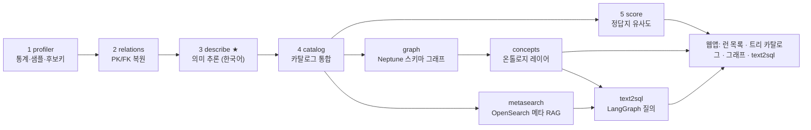

# db2doc v2 — 기술 가이드

> **무엇을 하는 시스템인가**: 문서가 전혀 없는 데이터베이스(주석 0, FK 제약 0)에 연결해서,
> 스키마와 데이터만 보고 ① 테이블/컬럼의 **의미(description)를 한국어로 추론**하고,
> ② **데이터 카탈로그**를 만들고, ③ 공식 정답지와 **유사도를 측정**해 품질을 숫자로 증명하고,
> ④ 그 위에 **온톨로지(개념) 레이어**를 얹어 text2sql의 기반으로 쓴다.
>
> 검증 환경: OMOP CDM 5.3 / GiBleed 합성 데이터 (37 테이블, 396 컬럼, AWS RDS PostgreSQL 16) ·
> LLM은 AWS Bedrock Claude Opus 4.8 · 그래프는 AWS Neptune Analytics (openCypher)

---

## 목차

1. [전체 아키텍처](#1-전체-아키텍처)
2. [인용 논문과 차용 내역](#2-인용-논문과-차용-내역)
3. [추론 방법 — 신호 수집부터 description까지](#3-추론-방법--신호-수집부터-description까지)
4. [평가(채점) 방법](#4-평가채점-방법)
5. [온톨로지(개념) 레이어](#5-온톨로지개념-레이어)
6. [활용 방법](#6-활용-방법)
7. [text2sql 테스트 — 메타데이터 RAG + Graph + LangGraph](#7-text2sql-테스트--메타데이터-rag--graph--langgraph)
8. [실행 레퍼런스](#8-실행-레퍼런스)

---

## 1. 전체 아키텍처



| 단계 | 파일 | 입력 → 출력 |
|---|---|---|
| 1. 프로파일링 | `profiler.py` | DB → `profile.json` (통계, 샘플, 후보키) |
| 2. 관계 복원 | `relations.py` | profile → `relations.json` (PK/FK + 출처 + 신뢰도) |
| 3. 의미 추론 | `describe.py` | profile + relations → `descriptions.json` |
| 4. 카탈로그 | `catalog.py` | 1~3 통합 → `catalog.json` + 데이터 딕셔너리/COMMENT SQL/ERD |
| 5. 채점 | `score.py` | catalog vs 정답지 → `score.json` (judge/cosine/F1) |
| 7. 스키마 그래프 | `graph.py` | catalog → Neptune (openCypher 속성 그래프) |
| 개념 레이어 | `concepts.py` | catalog → `(:Concept)` 온톨로지 → Neptune |
| 메타 RAG | `metasearch.py` | catalog → OpenSearch 벡터 인덱스 (의미 검색) |
| text2sql | `text2sql.py` | 질문 → RAG+그래프 → SQL 생성·실행 (LangGraph) |
| 웹앱 | `webapp.py` | 런 관리 + 새 DB 연결 + 카탈로그/그래프/text2sql (`:8200`) |

설계를 관통하는 원칙: **근거 없는 생성/수정 금지**. LLM의 모든 산출은 데이터 증거
(값 포함관계, 분포, 조인 결과)로 게이트하거나, 검증 불가하면 신뢰도를 강등해 표시한다.
이 원칙 자체가 문헌 근거를 가진다 (§2의 [P7]).

---

## 2. 인용 논문과 차용 내역

모든 arXiv ID/DOI는 초록 페이지를 직접 fetch해 실재 확인했다. "차용한 것"과 "자체 설계"를
구분해 표기한다.

### 2.1 핵심 차용 (구현에 직접 반영)

| # | 논문/소스 | 차용한 것 | 구현 위치 |
|---|---|---|---|
| P1 | **DBAutoDoc** — Nagarajan & Altman 2026, arXiv:2603.23050 + 오픈소스 `MemberJunction/MJ packages/DBAutoDoc` (MIT) | PK/FK 통계 점수식, 결정적 게이트, 프롬프트 가드레일(enum 해석·이름 지어내기 금지·보수적 신뢰도), 자원 가드레일, S_overall 평가식 | `relations.py` 점수식·게이트, `describe.py` 프롬프트 규칙, `config.py` 토큰/호출 하드리밋, `score.py` S_overall |
| P2 | **LLM-FK** — Tang et al. 2026, arXiv:2603.07278 | "통계가 못 보는 FK를 LLM이 의미 추론으로 제안하고, 검증 패스가 거른다" (멀티에이전트, F1 93%+) | `relations.py` FK 3-소스 구조: LLM 제안 → 값 포함관계 검증 |
| P3 | **HoPF** — Jiang & Naumann, JIIS 2019, DOI:10.1007/s10844-019-00562-z | PK와 FK를 분리하지 않고 전역 정합으로 함께 선택 | PK-eligible 대상만 FK 타깃 허용, 출처 신뢰순 병합 |
| P4 | **Gao & Luo (Alibaba)** 2025, arXiv:2502.20657 | coarse-to-fine(DB→테이블→컬럼) + fine-to-coarse(상향 집계) 이중 패스 | FK 위상순 순회(부모 설명을 자식 컨텍스트로) + DB 설명 상향 합성 |
| P5 | **CoVe** — Dhuliawala et al. (Meta), ACL Findings 2024, arXiv:2309.11495 | 생성 → 독립 검증 → 수정 (검증의 독립성이 핵심) | sanity 루프: 의존성 그룹별 모순 탐지 → 걸린 테이블만 1회 재생성 |
| P6 | **CRITIC** — Gou et al., ICLR 2024, arXiv:2305.11738 | "주장 → 검사 가능한 프로브 → 판정" — 도구에 근거한 비평만 유효 | LLM FK 제안의 값 검증, 코드값 라벨의 실제 JOIN 확인 |
| P7 | **Huang et al.**, ICLR 2024, arXiv:2310.01798 (+ Kamoi TACL 2024, arXiv:2406.01297) | **부정 결과**: 외부 피드백 없는 self-review는 오히려 악화 | 설계 제약으로 채택 — 맨몸 재생성 패스 없음. 모든 수정은 외부 증거로만 트리거 |
| P8 | **RAT-SQL** — Wang et al., ACL 2020, arXiv:1911.04942 | 스키마를 typed-relation 그래프로 인코딩 | `graph.py` 그래프 모델 (`HAS_COLUMN`/`REFERENCES`/`JOINS_TO`) |
| P9 | **ATHENA** — Saha et al., VLDB 2016 (vldb.org/pvldb/vol9/p1209) | 자연어 → 온톨로지 매칭 → 스키마로 내려가는 2단계 해석 | `concepts.py` 개념 레이어 |
| P10 | **BIRD** — NeurIPS 2023, arXiv:2305.03111 / **Spider 2.0** — ICLR 2025, arXiv:2411.07763 | 스키마 설명이 text2sql 정확도 +13~20pt / 엔터프라이즈에서 메타데이터 부재 = 지배적 실패 요인 | 카탈로그의 존재 근거; 구조화 레코드 출력 |
| P11 | **MT-Bench** — NeurIPS 2023, arXiv:2306.05685 / **G-Eval** — EMNLP 2023, arXiv:2303.16634 | LLM-as-judge 편향과 reference-guided 판정 설계 | `score.py` judge: 정답 참조 동등성 판정 + 사유 기록 |
| P12 | **ValueNet** (ICDE 2021, arXiv:2006.00888) / **Microsoft UniSAr** / **SteinerSQL** (EMNLP 2025, arXiv:2509.19623) | FK 그래프 최단경로/Steiner tree로 FROM/JOIN 복원 | 그래프 페이지 조인 경로 탐색 + JOIN SQL 스켈레톤 |

### 2.2 참고 (방향 검증·로드맵)

- **Cocoon** (arXiv:2404.12552) — 의미 가설 먼저, 통계는 그 관점에서 해석. **AutoDDG**
  (arXiv:2502.01050) — profile-then-describe, reference-free 평가 트랙.
- **Wretblad et al.** (arXiv:2408.04691) — LLM 생성 컬럼 설명이 인간 gold보다 하류 text2sql에
  더 유효할 수 있음; "장황 허용" 근거.
- **Zhang et al.** (PVLDB 2010, DOI:10.14778/1920841.1920944) — 다중 컬럼 FK·랜덤니스 테스트
  (로드맵). **Doduo** (SIGMOD 2022, arXiv:2104.01785) — 테이블 단위 일괄 컬럼 주석.
- **Neo4j neocarta/dbxcarta** — `Database→Table→Column` + `REFERENCES{confidence}` 모델이
  업계 표준임을 확인. **SelfCheckGPT** (EMNLP 2023) · **Semantic Entropy** (Nature 2024) —
  샘플 일관성 기반 신뢰도(로드맵).

### 2.3 자체 설계 (차용 아님)

- **빈 테이블 보강**: 0행 테이블은 통계 추론이 불가능 → 이름 규칙 기반 저신뢰 후보로 보강하되
  `data_unverified` 플래그로 검수 큐에 올림.
- **full-table 정확 유일성 검증**: 샘플이 아니라 전체 테이블 `COUNT(DISTINCT)`로 PK 후보를
  확정/기각 — 중복행이 있는 데이터에서 가짜 PK를 차단.
- **역할 접두사 해석**: `preceding_*`, `*_parent_*` → 자기참조 FK, `*_id_1` 위치 접미사 정규화.
- **코드값 라벨 해석(resolve)**: 복원된 FK로 lookup 테이블을 실제 JOIN해 코드→라벨 쌍을
  프롬프트에 주입 (§3.4).
- **증거 원장 + calibration 리포트**: 컬럼별 증거 가용성 기록, 신뢰도 구간별 judge 정확도
  분리 산출 (§4.4).

---

## 3. 추론 방법 — 신호 수집부터 description까지

추론은 4단계다: **(A) 신호 수집 → (B) 키/관계 추론 → (C) 의미 추론 → (D) 자기검증·보정**.
각 단계의 입력·계산·판단 기준을 그대로 적는다.

### 3.A 신호 수집 (프로파일링)

문서 없는 DB가 노출하는 것은 ① 이름(테이블/컬럼), ② 타입, ③ 데이터 자체뿐이다.
여기서 추론의 원료가 되는 신호를 다음과 같이 계산한다 (`profiler.py`).

**테이블당 1회의 집계 쿼리**로 모든 컬럼의 통계를 한 번에 뽑는다 (컬럼별 쿼리 N번이 아니라):

```sql
SELECT count(*),
       count(col1), count(DISTINCT col1), min(col1)::text, max(col1)::text,
       count(col2), count(DISTINCT col2), ...
FROM (SELECT * FROM cdm.person LIMIT 1000) s     -- 1000행 샘플
```

컬럼마다 산출되는 신호와 그 의미:

| 신호 | 계산 | 추론에서의 의미 |
|---|---|---|
| `null_ratio` | 1 − count(col)/count(*) | 필수 필드인가, 옵션 필드인가 |
| `distinct_ratio` | distinct/non-null | **1.0에 가까우면 식별자**, 0에 가까우면 **코드값(enum)** |
| `min`, `max` | 텍스트 캐스팅 후 | 값 범위 — 연도인지, 금액인지, ID 대역인지 |
| `top_values` | 빈도순 상위 10개 값 | enum이면 사실상 전체 도메인이 보임 |
| `is_enum_candidate` | distinct ≤ 50 | 코드값 후보 표시 → 의미 추론 시 값 분포 전체 제공 |

**유일성은 샘플로 끝내지 않는다.** 샘플에서 distinct_ratio ≥ 0.95인 컬럼은 전체 테이블에
`COUNT(DISTINCT col)`을 한 번 더 날려 **정확한 유일성**을 확정한다. 샘플 1000행에서는
유일해 보여도 전체에서는 중복인 컬럼(예: 중복 적재된 행)이 흔하기 때문이다. 단일 컬럼이
전부 실패하면 앞쪽 `*_id` 컬럼 2개 조합으로 복합키 후보도 검사한다.

### 3.B 키/관계 추론

#### PK 추론

테이블에 데이터가 있으면 컬럼마다 점수를 계산한다:

```
score = 50·f_u + 20·n + 15·d + 15·p          (임계 70점)

f_u (유일성): full-table distinct로 확정된 1.0만 만점.
              0.9~1.0 구간은 이름이 정확히 <table>_id일 때만 인정(더티 중복 허용),
              그 미만은 0 — 유일하지 않다고 "증명된" 컬럼은 자격 박탈.
n   (이름):   <table>_id = 1.0, 그 외 *_id/id = 0.6
d   (타입):   정수형 1.0, 그 외 0.3
p   (위치):   첫 컬럼 1.0에서 컬럼 순서마다 감점 (PK는 보통 앞에 선언됨)
```

단일 후보가 없으면 복합키 후보(§3.A)를 confidence 0.7로 채택한다.
**데이터가 0행인 테이블**은 통계가 무력하므로 이름 규칙으로만 추정하되 — `<table>_id`가
있으면 그것, 없으면 유일한 `*_id` 컬럼(단, `*_concept_id`/`*_source_id` 같은 참조형 이름과
다른 테이블의 id를 가리키는 이름은 제외) — **confidence 0.4 + 출처 `name`**으로 명시한다.
데이터가 있는 테이블에는 이 이름 폴백을 절대 적용하지 않는다(통계가 기각한 후보를
이름이 되살리는 것을 금지).

#### FK 추론 — 3개 소스의 결합

서로 다른 강점을 가진 후보 생성기 3개를 돌리고, 전부 같은 검증·게이트를 통과시킨다.

**소스 1 — 통계(값 포함관계)**: 모든 `*_id` 컬럼 × 모든 PK 보유 테이블 쌍에 대해,
이름 유사도가 있는 쌍만 골라 **inclusion dependency**를 측정한다:

```sql
-- 자식 컬럼의 distinct 값 200개를 떠서
SELECT DISTINCT child_col FROM child WHERE child_col IS NOT NULL LIMIT 200;
-- 부모 PK 도메인에 몇 %나 존재하는지 센다
SELECT DISTINCT pk FROM parent WHERE pk = ANY(:child_values);
```

포함율 v와 이름 유사도 s로 점수를 매긴다: `score = 40·v + 20·s + 15 + 15 + 10·ν`.

이름 유사도는 단순 매칭이 아니라 **역할 접두사를 해석**한다:
`preceding_visit_occurrence_id`는 "preceding"을 벗기면 `visit_occurrence_id` → 자기 테이블
또는 visit_occurrence를 가리키는 **자기참조/역할 FK**로 인식한다. `domain_concept_id_1`
같은 위치 접미사 `_1`/`_2`도 정규화한다. varchar 키(예: `vocabulary_id`)는 이름이 강하게
일치할 때만 허용한다.

**소스 2 — 이름 규칙 (빈 테이블 전용)**: 자식 테이블이 0행이면 값 포함을 잴 수 없다.
`<parent>_id` 형태의 강한 이름 일치만 confidence 0.4, 출처 `name`으로 제시한다 —
recall을 지키되 신뢰도로 정직하게 표시해서 검수로 보낸다.

**소스 3 — LLM 제안 + 값 검증** [P2]: 통계와 이름이 모두 놓치는 FK(이름이 안 닮은 참조,
도메인 관례)를 잡기 위해, 스키마 전체(테이블·컬럼 목록 + 이미 커버된 FK)를 LLM에 주고
"빠진 참조 관계를 제안하라"고 한다. **제안은 그대로 믿지 않는다**: 존재하는 테이블/컬럼인지
검증하고, 자식에 데이터가 있으면 소스 1과 같은 값 포함 측정을 돌려 **포함율 < 0.5면 기각**한다.
통과하면 `llm+stat`(conf 0.5+0.4·v), 측정 불가면 `llm`(conf 0.5)으로 출처를 남긴다.

**게이트와 병합**: G1 이름/LLM 신호 필수 → G2 포함율 < 0.5 컷 → G3 점수 컷 → G4 자식
컬럼당 부모 1개(출처 신뢰순: declared > stat = llm+stat > llm > name) → G5 허브 테이블로의
저신호 fan-in 강등 → G6 PK-eligible 타깃만. DB에 선언된 제약이 있으면 항상 최우선이다.

**왜 이 단계가 의미 추론보다 먼저인가**: FK는 "이 컬럼이 무엇을 가리키는가"라는, 이름과
통계만으로는 알 수 없는 **의미의 절반**을 데이터로 확정해 준다. 다음 단계의 컨텍스트
전파와 코드값 해석이 전부 여기에 의존한다.

### 3.C 의미 추론 (description 생성)

#### 처리 순서 — 부모 먼저, 자식은 부모를 알고 쓴다

FK 그래프를 위상정렬해서 **참조되는(부모) 테이블부터** 설명을 생성한다 [P4].
자식 테이블 차례가 오면, 이미 완성된 부모 설명들을 `neighbour_table_descriptions`로
프롬프트에 넣는다. `drug_exposure`를 설명할 때 모델은 `person`("환자 인구학 정보")과
`concept`("표준 어휘 개념")이 무엇인지 알고 있는 상태다.

#### 프롬프트에 들어가는 증거 패키지

테이블당 1회의 구조화 호출(JSON 스키마 강제)로 테이블 설명 + 전 컬럼 설명 + 신뢰도를
한 번에 받는다. 입력은 다음을 전부 포함한다:

```json
{
  "table_name": "person", "row_count": 2694,
  "recovered_relations": {
    "primary_key": ["person_id"],
    "foreign_keys": ["gender_concept_id -> concept.concept_id (confidence 0.95)"]},
  "neighbour_table_descriptions": {"concept": "표준 어휘 개념을 저장하는 ..."},
  "columns": [{
    "name": "gender_concept_id", "type": "integer", "nullable": false,
    "distinct_ratio": 0.0007, "null_ratio": 0.0,
    "min": "8507", "max": "8532",
    "enum_candidate": true,
    "value_distribution": [{"value":"8532","count":1373},{"value":"8507","count":1321}],
    "resolved_codes": [{"code":"8507","label":"MALE"},{"code":"8532","label":"FEMALE"}]
  }, ...]
}
```

#### 코드값 라벨 해석 (resolved_codes) — 추측을 증거로 바꾸는 장치

저카디널리티 코드 컬럼의 구체 의미는 이름·분포만으로는 확정할 수 없다(8507이 남성인지
여성인지는 데이터 어디에도 안 쓰여 있다 — 매핑 테이블을 조인하기 전까지는).
그래서 의미 추론 직전에, **복원된 FK를 따라 부모(lookup) 테이블을 실제 JOIN**한다:

1. FK 자식 컬럼이 enum 후보(distinct ≤ 50)이고 부모에 데이터가 있으면
2. 부모 테이블에서 레이블 컬럼을 고른다 — `name`/`label`/`title`/`description`을 이름에
   포함한 텍스트 컬럼 우선, 없으면 고카디널리티 텍스트 컬럼
3. 자식의 상위 코드 ≤ 8개를 부모에서 조회: `SELECT pk, label FROM parent WHERE pk IN (...)`
4. 결과 쌍을 해당 컬럼의 `resolved_codes`로 프롬프트에 주입

이러면 모델이 "성별 코드로 보인다"가 아니라 **"8507=MALE, 8532=FEMALE"을 데이터 근거로**
쓴다. 시스템 프롬프트도 "resolved_codes가 있으면 그 코드 의미는 데이터로 증명된 것이니
명시하라, 없으면 코드라는 사실까지만 말하고 매핑을 지어내지 마라"로 비대칭 지시한다.

#### 생성 규칙 (시스템 프롬프트의 판단 기준)

- **의미 우선, 데이터셋 상태는 부가 노트**: 컬럼이 전부 null이어도 정의는 "측정 단위에 대한
  FK"이고, "(이 데이터셋에서는 미적재)"는 괄호 노트로만 붙인다. 현재 상태를 정의처럼 쓰지 않는다.
- **키 컬럼은 무엇의 식별자인지까지**: "기본 키"가 아니라 "각 개인(환자)의 고유 식별자; PERSON
  테이블의 기본 키".
- **`*_source_value`/`*_source_concept_id` 관례**: 옆의 표준화 컬럼과 짝을 이뤄 "원천
  시스템의 원본 값/비표준 개념"임을 대비해 설명한다.
- **금지**: 입력에 없는 테이블/컬럼명 언급, 데이터가 지지하지 않는 사실 단정.
- **신뢰도는 보수적으로**: 모호하거나 검증 불가(0행 테이블)면 0.7 미만. 소표본에서의 보편
  주장("값은 X뿐")은 신뢰도 가산 금지.
- **출력은 한국어 산문** (식별자·코드·단위·도메인 약어는 원문 유지).

테이블 전체가 끝나면 37개 테이블 설명을 모아 **DB 수준 설명**(도메인 + 한 문단)을 상향
합성한다 [P4]. 이 단계에서 모델은 "healthcare / clinical research (OMOP CDM)"처럼 DB의
정체까지 식별한다.

### 3.D 자기검증과 신뢰도 보정

#### sanity 루프 — 모순 탐지 후 1회 재생성

개별 테이블 단위 생성은 전체 일관성을 보장하지 않는다. 그래서 생성 완료 후 FK로 연결된
테이블 묶음(부모 + 그 자식들 = 의존성 그룹, OMOP 런 기준 13개 그룹)별로 LLM 검증 패스를
돌린다 [P5]. 검사 항목: FK 방향과 설명의 정합(자식 설명이 부모를 잘못 지칭하는가),
같은 컬럼명의 상충 설명, 테이블 목적 오인, 용어 불일치. **material 이슈만** 보고하게 하고
(문체 차이는 무시), medium/high 이슈가 걸린 테이블만 이슈 텍스트를 프롬프트에 추가해
**딱 1회 재생성**한다.

재생성을 1회로 제한하고 "다시 읽고 개선하라"식 무조건 재생성을 두지 않는 이유:
외부 피드백 없는 self-review는 품질을 오히려 떨어뜨린다는 것이 실증돼 있다 [P7].
여기서 외부 피드백 = 명시적 모순 리포트다.

#### 증거 기반 confidence 보정

모델이 자가 보고한 confidence를 그대로 쓰지 않는다. 컬럼마다 **증거 원장**을 기록하고:

```
evidence = {has_data: 행이 있었나, has_distribution: 분포를 측정했나,
            resolved_codes: 코드 라벨이 JOIN으로 확인됐나}

- 데이터 없음(빈 테이블)      → confidence = min(c, 0.9) × 0.5, data_unverified 플래그
- resolved_codes 확인됨       → confidence + 0.05 (상한 1.0)
```

즉 최종 신뢰도 = 모델의 의미적 확신 × 데이터 증거 가용성. `data_unverified` 항목은
자동으로 사람 검수 대상이 된다. 이 보정이 실제로 의미 있는 숫자를 만드는지는 채점에서
별도 검증한다 (§4.4 calibration).

### 3.E 종합 예시 — `person.gender_concept_id` 한 컬럼의 추론 전 과정

| 단계 | 시스템이 한 일 | 결과 |
|---|---|---|
| A 신호 | distinct_ratio 0.0007, top 값 2종(8532/8507) 반반 | enum 후보 |
| B 관계 | 값 200개가 concept.concept_id에 100% 포함 + 이름 신호 | FK → concept (conf 0.95) |
| C 해석 | concept에서 레이블 컬럼(concept_name) 탐지, 코드 JOIN | 8507=MALE, 8532=FEMALE |
| C 생성 | 증거 패키지로 설명 생성 | "개인의 성별을 식별하는 표준 concept(CONCEPT에 대한 FK). 해석된 값: 8507=MALE, 8532=FEMALE." |
| D 보정 | has_data ✓ / distribution ✓ / resolved ✓ | confidence 1.0 |

---

## 4. 평가(채점) 방법

### 4.1 채점 대상과 정답지

OMOP CDM은 공식 데이터 딕셔너리(CSV)가 공개돼 있어 "정답이 있는" 드문 실험 환경이다.
대상 DB에서 문서를 전부 지우고 복원한 뒤, 외부 정답지와 1:1 대조한다. 정답지는
`translate.py truth`로 한글화되어 한↔한 비교로 채점한다 (정답 NA/빈값 항목은 제외).

### 4.2 지표별 산출 방법 — 점수의 출처를 명시

| 지표 | 방법 | LLM 사용 | 모델 |
|---|---|---|---|
| **의미 일치 (judge)** — 메인 | 정답지를 참조로 주고 "생성 설명이 이 필드가 *무엇인지*를 올바르게 담는가"를 true/false 판정 + 사유 [P11] | **예** | Bedrock Claude Opus 4.8 |
| cosine — 보조 | 생성/정답 텍스트 임베딩의 코사인 유사도 | 아니오 | Titan Embed v2 (다국어) |
| PK/FK F1 | 정답지의 isPrimaryKey/isForeignKey와 **결정적 집합 비교** | 아니오 | — |
| S_overall | DBAutoDoc 식 `0.35·F1_FK + 0.30·F1_PK + 0.20·C_tbl + 0.15·C_col` [P1] | 아니오 | — |

cosine을 메인으로 쓰지 않는 이유: OMOP 정답은 깔끔한 정의가 아니라 장문 ETL 지침이
많아서, 의미가 같아도 문체·길이 차이로 cosine이 낮게 나온다. 의미 동등성은 judge가 본다.
judge 결과는 항목별로 `score_details.json`에 저장되어 UI에서 생성 vs 정답을 나란히 보며
불일치 사유까지 확인할 수 있다.

**정직성 노트**: 현재 생성 모델과 judge가 같은 모델(Opus 4.8)이다. reference-guided
판정이라 자기강화 편향 여지가 작지만, 고객 제시용 최종 수치는 다른 모델 패밀리 judge로
교차 채점을 권장한다 [P11].

### 4.3 결과 (OMOP CDM 5.3 / GiBleed, 37 테이블 / 396 컬럼)

아래 수치는 **추론 프롬프트에서 도메인 고유명사(OMOP·SNOMED 등)를 모두 제거한 상태**의
한국어 측정값이다. 즉 "이 DB가 무엇인지 모르는" 진짜 블라인드 조건이다.

| 지표 | 측정값 | 산출 방식 |
|---|---|---|
| PK 복원 F1 | **0.945** (precision 0.897 / recall **1.0**) | 결정적 집합 비교 |
| FK 복원 F1 | **0.963** (precision 0.939 / recall 0.987, 정답 157개 중 155개) | 결정적 집합 비교 |
| 컬럼 의미 일치 (n=275) | **0.953** | LLM judge |
| 테이블 의미 일치 (n=37) | **1.00** | LLM judge |
| 커버리지 | 컬럼 99.6% / 테이블 100% | 결정적 |
| S_overall | **0.970** | 산식 |
| LLM 비용 (describe) | in 268k / out 54k 토큰, 55 호출 | — |

남은 컬럼 불일치(~13건)는 대부분 정답지가 ETL 규약 디테일("이 필드는 분석에 사용
비권장" 등)까지 요구하는 케이스로, 스키마+데이터만으로는 도달 불가한 영역이다.

> **블라인드 검증 노트**: 초기에는 프롬프트에 OMOP 명명 관례 힌트가 일부 들어 있었으나,
> 평가 순수성을 위해 전부 제거하고 재측정했다. 제거 후 컬럼 의미 일치는 0.942 → **0.953으로
> 오히려 상승** — 도메인 힌트가 점수에 기여하지 않았고, 정확도가 데이터 증거(통계·복원된
> 관계·코드값 조인)에서 나옴을 입증한다. 정답지(`truth/*.csv`)는 채점에만 쓰이며 추론
> 코드는 어디서도 읽지 않는다.

### 4.4 calibration — 신뢰도 자체를 검증

신뢰도 구간별 judge 정확도를 분리 산출한다: conf≥0.7 그룹 **0.980**, conf<0.7 그룹 0.918.
고신뢰 항목이 실제로 더 정확하다는 뜻이고, 저신뢰 항목은 보수적 플래그(빈 테이블 등)로
검수 대상이 된다. **이 지표가 중요한 이유**: 사람 검수 큐가 "낮은 신뢰도만 보면 된다"로
성립하려면 신뢰도가 보정된 숫자여야 한다. §3.D의 증거 기반 보정이 그 역할을 한다.

---

## 5. 온톨로지(개념) 레이어

### 5.1 구조 — 3계층 그래프

물리 스키마 그래프 위에 비즈니스 개념 층을 얹는다. 전부 Neptune Analytics 한 그래프에
openCypher로 적재된다.

```
[개념층]   (:Concept {name, name_ko, description(한국어), synonyms, confidence})
              (:Concept)-[:IS_A]->(:Concept)              ← 도메인 계층
              (:Concept)-[:MAPPED_TO {confidence}]->(:Table | :Column)
[테이블층] (:Database)-[:HAS_TABLE]->(:Table {description, rowcount, pk})
              (:Table)-[:JOINS_TO {via, source, confidence}]->(:Table)  ← 조인 계획용
[컬럼층]   (:Table)-[:HAS_COLUMN]->(:Column {description, confidence, is_pk})
              (:Column)-[:REFERENCES {source, confidence}]->(:Column)   ← 복원 FK
```

스키마 그래프 모델은 RAT-SQL [P8]과 Neo4j 공식 text2sql 시맨틱 레이어(neocarta)가 선례.
개념층은 ATHENA [P9]의 "용어 → 온톨로지 → 스키마" 2단계 해석 구조다.

### 5.2 어떻게 만드나

`concepts.py extract`가 카탈로그(테이블 설명 + 컬럼 목록)를 LLM에 주고 추출한다:

- 15~35개 개념, 사용자가 질문에서 실제로 부를 법한 것 위주 + 묶음용 추상 부모 2~6개
- 각 개념: 영문 정식명 + **한국어 이름** + 한국어 설명 + **동의어**(한/영, 사용자가 칠 법한
  말) + IS-A 부모 + 매핑 테이블 + 핵심 컬럼 + 신뢰도

추출 후 **grounding 검증**: 존재하지 않는 테이블/컬럼 참조는 제거·보고하고, IS-A 부모가
목록에 없으면 끊는다. "근거 없는 생성 금지" 원칙이 여기도 적용된다.

OMOP 런 실측: 개념 39개, IS-A 15개, 스키마 매핑 172개(테이블 37 + 컬럼 135).
계층 예시: `Condition Occurrence / Drug Exposure / Measurement / Observation → Clinical
Event(임상 이벤트)`, `Visit → Encounter`, `Death → Patient`.

```json
{"name": "Patient", "name_ko": "환자",
 "synonyms": ["환자", "대상자", "사람", "Person", "Subject"],
 "is_a": null, "tables": ["person"],
 "key_columns": ["person.person_id", "person.gender_concept_id", ...]}
```

### 5.3 왜 필요한가 — 스키마 그래프와의 역할 분담

| 질문 | 답하는 층 |
|---|---|
| "**환자**가 어디 있어?" (용어→스키마) | 개념층: '환자' → Concept(Patient) → `person` |
| "처방이랑 **진료의**를 어떻게 조인해?" | 테이블층: `JOINS_TO` 최단경로 → JOIN SQL |
| "이 코드 컬럼이 뭘 참조해?" | 컬럼층: `REFERENCES` + resolved 라벨 |

스키마 그래프만으로는 사용자의 자연어 용어("처방", "진료의")를 물리 이름(`drug_exposure`,
`provider`)에 잇지 못한다. 그 간극을 개념층의 동의어와 매핑이 메운다.

---

## 6. 활용 방법

### 6.1 text2sql 스키마 링킹 (주 용도)

질문 "환자별 처방 의사 목록"의 처리 흐름이 그래프 위에서 그대로 동작한다:

```
1. 용어 매칭   "환자"→Patient, "처방"→Drug Exposure, "의사"→Provider   (개념층 동의어)
2. 스키마 해석  MAPPED_TO → person, drug_exposure, provider             (개념→테이블)
3. 조인 계획   JOINS_TO 최단경로:
               drug_exposure → person (person_id)
               drug_exposure → provider (provider_id)                   (테이블층) [P12]
4. SQL 스켈레톤 SELECT ... FROM drug_exposure
               JOIN person ON drug_exposure.person_id = person.person_id
               JOIN provider ON drug_exposure.provider_id = provider.provider_id
5. 컨텍스트 주입 경로상 테이블·컬럼의 한국어 description + 신뢰도를
               text2sql LLM의 프롬프트에 첨부                           (컬럼층) [P10]
```

조인 경로 openCypher (Neptune Analytics 방언 — `shortestPath()` 미지원이라 길이순
over-fetch 후 앱에서 단순경로 필터):

```cypher
MATCH p = (a:Table {name: $frm})-[:JOINS_TO*1..5]-(b:Table {name: $to})
RETURN [n IN nodes(p) | n.name] AS names,
       [e IN relationships(p) | e.via] AS vias
ORDER BY size(vias) ASC LIMIT 40
```

그래프 페이지(`/runs/<id>/graph`)가 이 전체를 시각적으로 제공한다: 개념 검색("환자" 입력)
→ 개념 포커스 → 매핑 테이블 클릭 → 조인 경로 탐색 → JOIN SQL 복사.

**신뢰도 활용 팁**: `JOINS_TO.source`가 `name`(이름 추정, 데이터 미검증)인 엣지는 text2sql
플래너에서 가중치를 낮추거나 사용자 확인을 받는 것이 안전하다. declared > stat/llm+stat >
llm > name 순으로 신뢰한다.

### 6.2 데이터 카탈로그 / 검수 워크플로

- `catalog.json` — 컬럼 단위 구조화 레코드(설명·키·통계·증거·신뢰도). 검색 인덱스나
  타 카탈로그 시스템으로 내보내기 좋은 형태 [P10의 Spider 2.0 교훈: 정적 블롭이 아니라
  검색 가능한 레코드로].
- `data_dictionary.md` / `comments.sql` — 사람이 읽는 딕셔너리, DB에 주석을 되돌려 넣는
  COMMENT 문.
- **검수 우선순위**: `data_unverified` 플래그 또는 conf<0.7 항목만 사람이 보면 된다 —
  §4.4의 calibration이 이 triage의 근거다.

### 6.3 확장 로드맵

- **임베딩 스키마 검색**: 컬럼/테이블 설명 임베딩을 의미 검색으로 → **구현됨**(§7,
  OpenSearch Serverless 메타데이터 RAG). 동의어 사전에 없는 표현도 의미 거리로 매칭.
- **교차 judge 채점**(§4.2), **랜덤니스 게이트**(Zhang 2010), **승인 학습 루프**(검수 교정을
  few-shot으로 재주입), 검수 이력 메타스토어.

---

## 7. text2sql 테스트 — 메타데이터 RAG + Graph + LangGraph

복원한 온톨로지·그래프·메타데이터가 실제로 자연어 질의에 충분한지 확인하는 테스트 탭
(`/runs/<id>/text2sql`). 세 검색 기반을 LangGraph로 엮어 SQL을 생성·실행한다.

### 7.1 왜 메타데이터 RAG가 별도로 필요한가

스키마 링킹("이 질문에 어떤 테이블·컬럼이 필요한가")에는 두 종류의 검색이 있다:

| | 무엇을 찾나 | 도구 |
|---|---|---|
| **의미 검색** | "투약 이력" 같은 질문 용어를, 동의어 사전에 없어도 의미가 가까운 컬럼/테이블에 매칭 | **OpenSearch** (임베딩 벡터) |
| **구조 검색** | 매칭된 테이블들을 어떻게 조인하나 — FK, 조인 경로, 개념 계층 | **Neptune** (그래프 순회) |

개념 레이어의 `synonyms` 문자열 매칭(§5)은 LLM이 미리 뽑아둔 표현만 잡는다. 사용자가
사전에 없는 말("투약 이력"→`drug_exposure`)을 쓰면 놓친다. **벡터 검색은 description
임베딩으로 의미 거리를 재므로** 사전에 없던 표현도 잡는다. 결정적으로, 수천 테이블 규모
(전체 스키마가 LLM 컨텍스트에 안 들어가는 엔터프라이즈 DB; Spider 2.0이 보인 91%→21% 붕괴
지점 [P10])에서는 "벡터로 후보를 좁히고 → 그래프로 조인 확장"이 **필수**가 된다.
현재 37테이블 규모에선 정확도 이득이 작지만, **대규모로 스케일해도 그대로 동작하는
아키텍처를 갖춰둔 것**이다.

구현: `metasearch.py` — 카탈로그의 테이블/컬럼 description을 Titan Embed v2(다국어 →
한국어 설명 그대로)로 임베딩해 OpenSearch Serverless 벡터 인덱스(faiss HNSW, cosine)에
적재(433 docs). 검색은 질문 임베딩으로 knn top-k.

### 7.2 LangGraph 파이프라인 (`text2sql.py`)

`StateGraph`로 5개 노드를 잇는다. 각 노드의 중간 산출이 UI에 단계별로 보인다.

```
retrieve → expand → generate → execute ─(성공/한도)→ END
                          ↑                  │
                          └──── repair ──────┘  (DB 오류 시에만)
```

| 노드 | 하는 일 | 기반 |
|---|---|---|
| **retrieve** | **하이브리드 검색** — ① 의미가 가까운 테이블/컬럼 top-k(벡터) ∪ ② 질문 용어에 매칭되는 **개념**과 그 IS_A 하위 개념이 가리키는 테이블 | OpenSearch 벡터 + Neptune 개념 레이어 |
| **expand** | retrieve한 테이블들의 PK/FK + 쌍별 최단 조인 경로 | Neptune openCypher |
| **generate** | retrieve+expand한 스키마 컨텍스트(설명·키·조인조건)**만**으로 PostgreSQL 작성 | Claude (JSON 강제) |
| **execute** | RDS에 **읽기 전용** 실행 — SELECT만 정규식 가드, LIMIT 자동, 15s 타임아웃, 결과 미리보기 | RDS PostgreSQL |
| **repair** | 실행이 DB 오류로 실패하면 오류 메시지를 프롬프트에 넣어 재생성 (최대 2회) | — |

repair 루프는 **실제 DB 오류에만** 트리거된다 — 근거 없는 자기수정을 피하라는 §2 [P7]
원칙대로, "그냥 다시 봐"가 아니라 "이 SQL이 이 오류로 실패했다"는 외부 신호로만 돈다.
실행은 SELECT/WITH만 허용하고 INSERT/UPDATE/DELETE/DDL은 정규식으로 차단한다.

**개념 레이어의 역할 (retrieve의 ②)**: 벡터 검색은 개별 컬럼 설명과의 의미 거리를 재므로,
"임상 이벤트" 같은 **추상 상위 용어**는 잘 못 잡는다. 개념 레이어는 질문에서 `Concept`의
이름·한국어명·동의어를 매칭하고, 매칭된 개념의 `IS_A` 하위 개념까지 펼쳐 그들이
`MAPPED_TO`로 가리키는 테이블을 후보에 더한다. 실측: "임상 이벤트 유형별 발생 건수" →
개념 `Clinical Event` 매칭 → 벡터 검색이 놓친 8개 테이블(measurement·observation·death·
device_exposure 등)을 IS_A 계층으로 보강. UI의 retrieve 단계에 매칭된 개념과 보강된
테이블이 호박색으로 표시된다.

### 7.3 동작 예시 (실측)

질문 "환자별 처방 약물 수를 많은 순으로":
1. retrieve → `drug_exposure`, `drug_era`, `cost`, `provider`, `drug_strength`
2. expand → `drug_exposure` PK/FK + person/concept 조인 경로
3. generate → `SELECT person_id, COUNT(drug_exposure_id) AS drug_count
   FROM cdm.drug_exposure GROUP BY person_id ORDER BY drug_count DESC`
4. execute → 50행 (1회 성공, repair 불필요)

질문 "가장 흔한 진단 상위 10개" → `condition_occurrence`를 `concept`에 조인해 진단명까지
가져오는 SQL을 생성, 10행 반환. "여성 환자가 방문한 진료기관별 방문 횟수" → 코드값 해석
(§3.4)으로 학습된 `gender_concept_id = 8532`(여성)를 WHERE에 정확히 사용.

---

## 8. 실행 레퍼런스

```bash
cd v2

# 웹앱 (런 목록 + 새 DB 연결 + 시각화)
../.venv/bin/uvicorn webapp:app --port 8200 --reload     # → http://localhost:8200

# CLI 전체 파이프라인 (루트 .env의 RDS/Bedrock 설정 사용)
../.venv/bin/python run.py                # 1~6단계
../.venv/bin/python run.py --skip-score   # 정답지 없는 DB (카탈로그만)

# 한글화 (1회성 / 기존 영문 런 — 신규 런은 처음부터 한국어 생성)
../.venv/bin/python translate.py truth    # 정답 CSV → truth/*_ko.csv
V2_OUT_DIR=runs/<id> ../.venv/bin/python translate.py run

# Neptune 그래프 + 개념 레이어
../.venv/bin/python graph.py create                       # ~3분, $0.48/hr 과금 시작
V2_OUT_DIR=runs/<id> ../.venv/bin/python graph.py load
V2_OUT_DIR=runs/<id> ../.venv/bin/python concepts.py all  # 추출(LLM)+적재
../.venv/bin/python graph.py delete                       # ★ PoC 후 과금 중지

# text2sql용 메타데이터 RAG (OpenSearch Serverless) — §7
V2_OUT_DIR=runs/<id> ../.venv/bin/python metasearch.py index           # 카탈로그 → 벡터 인덱스
../.venv/bin/python metasearch.py search "환자별 투약 이력"            # 검색 프로브
V2_OUT_DIR=runs/<id> ../.venv/bin/python text2sql.py "질문..."         # CLI 파이프라인
# → 웹 탭: /runs/<id>/text2sql
```

| 환경변수 | 용도 | 기본값 |
|---|---|---|
| `BEDROCK_MODEL_ID` | 생성/judge LLM | `us.anthropic.claude-opus-4-8` |
| `BEDROCK_EMBED_MODEL_ID` | cosine·RAG 임베딩 | `amazon.titan-embed-text-v2:0` |
| `NEPTUNE_GRAPH_ID` | Neptune Analytics 그래프 | (graph.py create 출력) |
| `AOSS_ENDPOINT` | OpenSearch Serverless 컬렉션 엔드포인트 | (create-collection 출력) |
| `V2_OUT_DIR` | 런 산출물 디렉토리 | `out/` |
| `V2_MAX_LLM_TOKENS` / `V2_MAX_LLM_CALLS` | 자원 가드레일 [P1] | 800k / 400 |

비용 참고: describe 단계 약 268k in / 54k out 토큰(검증 루프 포함, 37테이블 기준).
Neptune Analytics 16 m-NCU 시간당 $0.48 + OpenSearch Serverless(최소 OCU 시간당 과금) —
**확인 끝나면 graph.py delete + OpenSearch 컬렉션 삭제로 과금 중지**.
