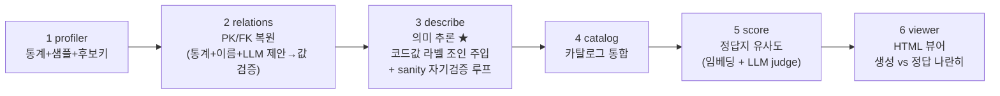

# db2doc **v2** — 문서 없는 DB의 의미를 복원해 카탈로그로

> 🚀 **처음 쓰는 분은 [`INSTALL.md`](INSTALL.md)** — repo 클론 → 설치 → 내 DB 연결 →
> 결과 확인까지 단계별 설치·사용 가이드.
>
> 📘 **상세 기술 가이드: [`GUIDE.md`](GUIDE.md)** — 인용 논문·차용 내역, description 생성
> 메커니즘, 평가 방법, 온톨로지 레이어, text2sql(메타 RAG+Graph+LangGraph)까지 전부 정리.

> v1(저장소 루트)과 **같은 메커니즘, 같은 샘플 DB(OMOP CDM 5.3 / GiBleed)**, 처음부터 다시 설계한 차세대 파이프라인.
> description을 전부 지운 DB에서 시스템이 테이블/컬럼 의미를 **유추**하고, **카탈로그**를 만들고,
> 공식 정답지와 **유사도를 측정**해 보여준다. v1은 그대로 보존, v2는 이 폴더에 독립적으로 존재한다.

---

## 파이프라인 (6단계)



실행 — 두 가지 방법:

```bash
cd v2

# (A) 웹 앱: 런 목록 홈 + 새 DB 연결 + 상세 결과 페이지
../.venv/bin/uvicorn webapp:app --port 8200
# -> http://localhost:8200  (첫 페이지에서 DB 연결 → 분석 시작 → 런 클릭해 결과 확인)

# (B) CLI: PG* 환경변수가 대상 DB, METASTORE_* 가 결과 저장소
../.venv/bin/python run.py --run-key myrun --name "내 DB"   # 카탈로그 생성·적재
../.venv/bin/python run.py --run-key omop --with-truth      # OMOP eval (채점 포함)
```

**결과는 전부 MySQL 메타스토어에 저장된다** (단일 진실 공급원). 파이프라인은 단일
프로세스 인메모리 체인으로 동작하며 중간/최종 산출물을 디스크 파일로 쓰지 않는다 —
스키마 그래프는 Neptune, 검색 인덱스는 OpenSearch에 적재된다. 웹앱의 조회·편집·
그래프·text2sql은 모두 메타스토어를 읽는다.

---

## description 생성 8가지 기법

문서가 없는 DB에서 의미를 복원하는 핵심 기법. 관통 원칙은 **"데이터로 확인되는 것만 자신
있게 말하고, 확인 못 한 건 낮은 신뢰도로 표시"** — 환각 방지. (각 기법의 동작 방식·실제
예시는 [`SOLUTION.md`](SOLUTION.md), 논문 근거는 [`GUIDE.md`](GUIDE.md) §3 참조)

| # | 기법 | 한 줄 요약 | 단계 |
|---|---|---|---|
| ① | **통계 신호로 컬럼 성격 판별** | distinct·null·분포로 식별자/코드값/범위 추론 (테이블당 1쿼리) | profiler |
| ② | **PK 전수검사 복원** | 전체 테이블 distinct로 유일성 확정 + 복합키, 선언키 우선 | relations |
| ③ | **FK 3-소스 복원** | 값 포함관계 + 이름 규칙 + LLM 제안→값 검증, 역할 접두사(`preceding_`/`_parent_`) 해석 | relations |
| ④ | **정밀도 방어 게이트** | 6개 검문소(이름·포함율·점수·1자식1부모·허브견제·PK대상)로 가짜 FK 제거 | relations |
| ⑤ | ★ **코드값 라벨 해석** | 복원된 FK로 lookup 테이블 실제 JOIN → `9201=입원`을 데이터 근거로 | describe |
| ⑥ | **관계 순서 맥락 전파** | FK 위상순으로 부모 먼저 설명 → 자식 컨텍스트로 활용, DB 도메인 종합 | describe |
| ⑦ | **생성→자기검증→재생성** | 의존성 그룹별 모순 탐지, 걸린 테이블만 1회 재작성 (근거 없는 self-review 금지) | describe |
| ⑧ | **증거 기반 신뢰도 보정** | 데이터 없는 컬럼 conf 강등+플래그 → 검수 큐 triage 성립 | describe |

블라인드 검증(추론 프롬프트에서 도메인 고유명사 전부 제거) 기준: **컬럼 의미 일치 95% /
테이블 100% / PK F1 0.95 / FK F1 0.96**. 도메인 힌트 제거 후 오히려 컬럼 judge가 상승해,
정확도가 도메인 지식이 아니라 데이터 증거에서 나옴을 입증.

---

## v1 대비 무엇이 다른가 (전부 v1 실측 약점에서 출발)

| # | v2 메커니즘 | v1의 약점 | 근거 |
|---|---|---|---|
| 1 | **단일 집계 쿼리 프로파일링** — 컬럼당 3쿼리 → 테이블당 1쿼리 | 스캔 ~9분 | (운영 개선) |
| 2 | **full-table 정확 유일성 검증 + 복합키 후보** — 샘플 1000행이 아니라 전체 테이블에서 distinct 확인 | 샘플상 unique인 가짜 PK(`drug_exposure` 중복행) | HoPF [3] |
| 3 | **FK 3-소스 결합**: 통계(포함관계) + 이름 + **LLM 제안 → 값 검증** | FK recall 0.47 (빈 테이블) | DBAutoDoc [1], LLM-FK [2] |
| 4 | **역할 접두사 해석** (`preceding_*`, `*_parent_*` → self-FK), 위치 접미사 정규화 (`*_id_1`) | self-FK 전부 누락 | — |
| 5 | **코드값 라벨 해석(resolve)**: 복원된 FK로 lookup 테이블을 **실제 JOIN**해 코드→라벨 쌍을 프롬프트에 주입 | "8507이 뭔지 모름" (검수로 미룸) | Cocoon [6], v1 C3 |
| 6 | **증거 원장(evidence ledger) + 신뢰도 보정**: 데이터 없는 컬럼은 conf 강등·플래그 | 빈 테이블 conf 0.92 과신 | 자기수정 한계 [7] |
| 7 | **생성→sanity검증→재생성 루프**: 의존성 그룹별 모순 탐지, 걸린 테이블만 이슈를 줘서 1회 재생성 | 검증이 conf 강등뿐, 재생성 없음 | CoVe [8], CRITIC [9] |
| 8 | **카탈로그 산출물**: 설명+키+통계+증거를 컬럼 단위 구조화 레코드로 | 산출물이 md/sql 텍스트뿐 | Spider 2.0 [10], BIRD [11] |
| 9 | **채점에 calibration 리포트**: conf≥0.7 vs <0.7 의 judge 정확도 분리 | conf가 못 믿을 숫자 | LLM-judge 베스트 프랙티스 [12] |
| 10 | **자원 가드레일**: 런 전체 토큰/호출 하드리밋 | 무제한 | DBAutoDoc 구현 [1] |

설계 제약: **근거 없는 self-review는 하지 않는다.** 모든 수정 단계(LLM FK 제안, sanity 재생성)는
외부 증거(값 포함관계, 명시적 모순 리포트)로 게이트한다 — "LLM은 외부 피드백 없이 자기 추론을
고치지 못한다"는 ICLR 2024 결과 [7]를 설계 원칙으로 채택.

---

## 결과 (GiBleed, 37 테이블, 정답지: OMOP 공식 데이터 딕셔너리)

측정값은 **블라인드 조건**(추론 프롬프트에서 OMOP·SNOMED 등 도메인 고유명사를 모두 제거 —
"이 DB가 무엇인지 모르는" 상태) + 한국어 기준이다.

| 지표 | v1 baseline | v1 개선 후 | **v2 (블라인드)** |
|---|---|---|---|
| PK F1 | 0.667 | 0.912 | **0.945** (recall **1.0**) |
| FK F1 | 0.394 | 0.619 | **0.963** (정답 157개 중 155개) |
| 컬럼 설명 의미 일치 (LLM judge, n=275) | 0.931 | 0.938 | **0.953** |
| 테이블 설명 의미 일치 (n=37) | 1.00 | 1.00 | **1.00** |
| S_overall | 0.687 | 0.840 | **0.970** |
| LLM 비용 (describe, in/out 토큰) | — | ~82k/30k | 268k/54k (검증 루프 포함) |

**블라인드 검증**: 초기 프롬프트에 일부 있던 OMOP 도메인 힌트를 평가 순수성을 위해 전부 제거하고
재측정. 제거 후 컬럼 judge가 0.942 → **0.953으로 오히려 상승** → 도메인 힌트가 점수에 기여하지
않았고, 정확도가 데이터 증거(통계·복원 관계·코드값 조인)에서 나옴을 입증. 정답지(`truth/*.csv`)는
채점에만 쓰이며 추론 코드는 일절 읽지 않는다(전수 확인).

**한글화**: 추론 설명과 정답지를 모두 한국어로 운영 (식별자·코드·기술 약어는 원문 유지).
- `translate.py truth` — OMOP 정답 CSV → `truth/*_ko.csv` (1회, score.py가 자동 우선 사용)
- `translate.py run` — 기존 런의 descriptions/concepts 번역 (영문 원본은 `*_en` 필드로 보존)
- 신규 런은 describe/concepts 프롬프트가 **처음부터 한국어로 생성** (번역 단계 불필요)

calibration 리포트(신뢰도가 믿을 만한 숫자인지): conf≥0.7 컬럼의 judge 정확도 **0.980**,
conf<0.7은 0.918 — 고신뢰 항목이 실제로 더 정확하고, 저신뢰 항목은 보수적 플래그(빈 테이블 등)로
검수 대상이 됨. "검증 불가인데 과신"하던 문제 없음.

> 측정 조건은 v1과 동일: FK/PK 제약·주석을 전부 제거한 DB에서 복원 → 공식 정답지와 대조.
> v2의 점프가 나온 곳 (각각 v1 오류 사례를 직접 잡은 것):
> - **PK**: full-table 유일성 검증이 "샘플 1000행에서만 unique"였던 가짜 PK(`drug_exposure` 등
>   중복행 보유 테이블)를 제거 + 데이터 있는 테이블의 name-fallback 금지.
> - **FK**: 역할 접두사/접미사 해석(`preceding_*`, `*_parent_*`, `*_id_1`)으로 self-FK 복원 +
>   varchar 키 허용(`concept_class_id` 등) + LLM 제안→값 검증.
> - **컬럼 설명**: 코드값을 복원된 FK로 실제 JOIN해 라벨 주입("8507=MALE") + "의미 우선,
>   데이터셋 상태는 부가 노트" 프롬프트 규칙 (demo 데이터의 'entirely null'을 정의처럼 쓰던
>   오류 제거).

---

## 참조 연구 (전부 초록 페이지를 fetch해 실재 확인)

핵심 차용:

1. **DBAutoDoc** — Nagarajan & Altman, *Automated Discovery and Documentation of Undocumented
   Database Schemas via Statistical Analysis and Iterative LLM Refinement*, 2026,
   arXiv:2603.23050. 오픈소스 구현 [MemberJunction/MJ](https://github.com/MemberJunction/MJ)
   `packages/DBAutoDoc/` (MIT). — 통계 PK/FK 점수화·게이트, 프롬프트 가드레일, 자원 가드레일.
2. **LLM-FK** — Tang, Zhang, Cai, Wang, *Multi-Agent LLM Reasoning for Foreign Key Detection
   in Large-Scale Complex Databases*, 2026, arXiv:2603.07278. — "통계가 못 보는 FK를 LLM이
   제안하고 검증 패스가 거른다"는 v2 FK 3-소스 구조의 직접 근거 (F1 93%+).
3. **HoPF** — Jiang & Naumann, *Holistic Primary Key and Foreign Key Detection*, JIIS 2019,
   DOI:10.1007/s10844-019-00562-z. — PK/FK를 분리하지 않고 전역 정합으로 선택하는 관점.
4. **Gao & Luo (Alibaba)**, *Automatic Database Description Generation for Text-to-SQL*,
   2025, arXiv:2502.20657. — coarse-to-fine + fine-to-coarse 이중 패스 설명 생성; "자동 생성
   설명 = 인간 설명 효과의 37%"라는 정직한 벤치마크.
5. **AutoDDG** — Zhang et al. (NYU), *Automated Dataset Description Generation using LLMs*,
   2025, arXiv:2502.01050. — profile-then-describe; reference-free 평가 트랙.
6. **Cocoon** — Huang & Wu (Columbia), *Semantic Table Profiling Using LLMs*, 2024,
   arXiv:2404.12552. — 의미 가설을 먼저 세우고 통계를 그 관점에서 해석.
7. **Huang et al.**, *Large Language Models Cannot Self-Correct Reasoning Yet*, ICLR 2024,
   arXiv:2310.01798. — 근거 없는 self-review 금지라는 v2 설계 제약의 근거.
8. **CoVe** — Dhuliawala et al. (Meta), *Chain-of-Verification Reduces Hallucination*,
   ACL Findings 2024, arXiv:2309.11495. — 독립 컨텍스트 검증 후 수정(sanity 루프의 형태).
9. **CRITIC** — Gou et al., *LLMs Can Self-Correct with Tool-Interactive Critiquing*,
   ICLR 2024, arXiv:2305.11738. — "주장→검사 가능한 프로브→판정" 패턴 (FK 값 검증이 그 사례).
10. **Spider 2.0** — Lei et al., ICLR 2025 (Oral), arXiv:2411.07763. — 엔터프라이즈 규모에서
    메타데이터 부재가 지배적 실패 요인(91.2%→21.3%): 카탈로그의 존재 근거.
11. **BIRD** — Li et al., NeurIPS 2023, arXiv:2305.03111. — 스키마 설명(external knowledge)이
    text2sql 정확도를 +13~20pt 올린다: 카탈로그 가치의 정량 근거.
12. **LLM-as-judge** — Zheng et al. (MT-Bench), NeurIPS 2023, arXiv:2306.05685;
    G-Eval, EMNLP 2023, arXiv:2303.16634. — 채점기의 reference-guided 판정 설계.

보조 참고: Doduo (SIGMOD 2022, arXiv:2104.01785) — 테이블 단위 일괄 컬럼 주석,
Zhang et al. (PVLDB 2010, DOI:10.14778/1920841.1920944) — 다중 컬럼 FK·랜덤니스 테스트,
Wretblad et al. 2024 (arXiv:2408.04691) — LLM 생성 컬럼 설명이 인간 gold보다 하류 text2sql에
유효할 수 있음(장황 허용의 근거), SelfCheckGPT (EMNLP 2023, arXiv:2303.08896) ·
Semantic Entropy (Nature 2024, DOI:10.1038/s41586-024-07421-0) — 샘플 일관성 기반 신뢰도
(로드맵), CHESS (arXiv:2405.16755) · Pneuma (SIGMOD 2025, arXiv:2504.09207) — 카탈로그를
검색 인덱스로 소비하는 패턴(로드맵).

---

## 폴더 구조

```
v2/
  config.py     # env/RDS/Bedrock + 토큰 가드레일
  profiler.py   # 1. 통계 프로파일 (단일 집계쿼리, full-table 키 검증, enum 분포)
  relations.py  # 2. PK/FK 복원 (통계+이름+LLM제안→값검증, 게이트 G1-G6)
  describe.py   # 3. 의미 추론 (코드값 라벨 조인 주입, sanity 자기검증 루프, 증거 보정)
  catalog.py    # 4. 카탈로그 빌드 (dict; 원본주석 보존, 읽기전용 — COMMENT/DDL 미생성)
  score.py      # 5. 정답지 유사도 (임베딩 cosine + LLM judge + calibration; eval 전용)
  concepts.py   #    개념(온톨로지) 레이어 추출/적재
  graph.py      # 7. 스키마 그래프: 카탈로그 dict → AWS Neptune (런별 전용 그래프)
  metasearch.py #    메타데이터 RAG: 카탈로그 dict → OpenSearch 벡터 인덱스
  text2sql.py   #    LangGraph: retrieve(RAG)→expand(그래프)→generate→execute→repair
  pipeline.py   #    ★ 인메모리 오케스트레이터: 위 단계를 한 프로세스로 엮어 메타스토어 적재
  ui.py / graph_ui.py / t2sql_ui.py / home_ui.py   # 웹 페이지 템플릿
  viewer.py     #    정적 HTML 뷰어 (단일 파일, 서버 불필요 — 메타스토어 미사용 데모용)
  webapp.py     #    FastAPI 웹 앱 (메타스토어 전용): 런 목록 + 새 DB 연결 + 상세/그래프/text2sql
  store/        #    메타스토어(MySQL): models·db·repo + schema.sql(DDL)
  run.py        #    CLI 진입점 (pipeline.run_pipeline 래퍼)
```

**메타스토어(MySQL, 필수)**: 결과의 단일 진실 공급원이다. 파이프라인은 단일 프로세스
인메모리 체인으로 동작하고 — 중간 산출물을 파일로 쓰지 않는다 — 최종 카탈로그·설명
(AI 원본 `ai_text` + 검수본 `current_text`)·검수 이력(`revisions`)·온톨로지(`concepts`)·
text2sql 이력(`t2sql_history`)을 DB에 적재한다. 웹 편집은 `revisions` 감사 이력으로 남고,
런 전용 Neptune 그래프 ID는 `runs.graph_id`에 저장된다. `.env`에 `METASTORE_*`(또는
`METASTORE_URL`)가 없으면 웹앱은 503으로 응답한다. 구성·DDL은 [`INSTALL.md`](INSTALL.md) §7.

웹 앱 구조: 홈(`/`)에서 ① 기존 런 리스트(상태·카탈로그 규모·judge/F1 점수·점수 출처 표시,
클릭하면 `/runs/<id>` 상세로) ② 새 DB 연결 폼(연결 테스트 → 분석 시작, 백그라운드 스레드로
인메모리 파이프라인 실행, 5초마다 자동 갱신). 임의 고객 DB는 정답지가 없으므로 기본은
**카탈로그만** 생성하고, OMOP 평가용 DB만 "정답지 채점 포함"(`with_truth`)을 켜서 유사도
점수까지 만든다. 원본 DB 접속 비밀번호는 실행 중 환경변수로만 쓰이고 어디에도 저장하지 않는다.

---

## 스키마 그래프 (AWS Neptune Analytics + openCypher) — text2sql 기반

생성된 카탈로그를 **속성 그래프**로 Neptune Analytics에 적재하고(`graph.py`),
웹앱 `/runs/<id>/graph`에서 시각화한다. text2sql의 스키마 링킹/조인 계획 기반이 되는
구조(스키마를 typed-relation 그래프로 인코딩 — RAT-SQL ACL 2020, arXiv:1911.04942;
온톨로지/제약 그래프 위 경로로 조인 구성 — ATHENA VLDB 2016).

모델링 근거(추가 검증): `(:Table)-[:HAS_COLUMN]->(:Column)` + `(:Column)-[:REFERENCES]->(:Column)`
패턴은 사실상의 표준이고(Neo4j 공식 text2sql 시맨틱 레이어 블로그·neocarta, OpenAI Cookbook
SchemaFlow), **복원 출처(provenance)·confidence를 엣지 프로퍼티로 싣는 것**은 Neo4j
dbxcarta의 LLM-추론 FK 패턴과 동일. 파생 Table→Table 엣지는 RAT-SQL의
`FOREIGN-KEY-TAB-*` 관계가 학술적 선례. FK 그래프 최단경로로 FROM/JOIN을 복원하는 것은
ValueNet(ICDE 2021, Dijkstra)·Microsoft UniSAr(`nx.shortest_path`)·SteinerSQL(EMNLP 2025,
Steiner tree)이 실제 코드로 쓰는 방식이다.

그래프 모델:
```
(:Database)-[:HAS_TABLE]->(:Table {name, description, rowcount, pk})
(:Table)-[:HAS_COLUMN]->(:Column {id, name, type, is_pk, description, confidence, examples})
(:Column)-[:REFERENCES {source, confidence}]->(:Column)   # 복원된 FK (컬럼 레벨)
(:Table)-[:JOINS_TO {via, source, confidence}]->(:Table)  # 파생: 조인 경로 계획 레이어
```
설명문(description)을 노드 프로퍼티로 저장 → 이후 Neptune Analytics **벡터 인덱스**
(그래프 생성 시점에만 설정 가능, 1~65,535차원)에 임베딩을 얹으면 "질문 → 벡터 검색으로
관련 테이블 → 그래프 탐색으로 조인 경로 확장"까지 단일 엔진으로 처리 가능 (로드맵).

사용 — **런마다 전용 Neptune 그래프**가 자동 생성된다 (그래프 ID는 메타스토어
`runs.graph_id`에 저장; 물리적으로 분리되어 런 간 노드가 절대 섞이지 않음). `run.py`/
웹앱이 분석 완료 시 `graph.load_catalog_to_graph(run_key, catalog)`로 자동 적재하므로
보통 별도 명령이 필요 없다. 웹앱에서 런을 삭제(✕)하면 그 런의 전용 그래프도 함께
삭제되어 과금이 멈춘다. **그래프당 시간당 과금이므로 안 쓰는 런은 삭제할 것.**

### 개념 레이어 (온톨로지) — `concepts.py`

스키마 그래프 위에 **비즈니스 개념 층**을 얹는다 (ATHENA VLDB 2016 방식: 자연어 용어 →
개념 → 스키마로 내려가는 2단계 매칭). LLM이 카탈로그 설명에서 개념을 추출하되, 존재하는
테이블/컬럼만 참조하도록 검증(grounding)한다 — 미존재 참조는 제거·보고.

```
(:Concept {name, name_ko, description, synonyms, confidence})
(:Concept)-[:IS_A]->(:Concept)                  # 도메인 계층 (예: 처방 IS_A 임상 이벤트)
(:Concept)-[:MAPPED_TO {confidence}]->(:Table)
(:Concept)-[:MAPPED_TO {confidence}]->(:Column) # 핵심 컬럼
```

개념 추출·적재도 `run.py`가 파이프라인 안에서 자동 수행한다
(`concepts.extract_concepts(catalog)` → `concepts.load_concepts_to_graph(...)`).

OMOP 런 실측: 개념 39개(환자/방문/임상 이벤트/어휘 등), IS_A 15개
(예: Condition/Drug/Measurement → Clinical Event), 테이블 매핑 37개.
그래프 페이지의 **"개념 레이어" 토글**로 호박색 다이아몬드 노드로 표시되고,
**개념 검색**(예: "환자", "처방")이 동의어까지 매칭해 해당 개념을 포커스한다.
이것이 text2sql 스키마 링킹의 1단계(용어→개념→테이블)에 해당한다.

시각화 페이지(`/runs/<id>/graph`, vis-network v10):
- 테이블 노드(크기=행수, 회색=빈 테이블) + 방향성 FK 엣지(점선=이름/LLM 추정 출처)
- 노드 클릭 → 우측에 테이블 설명·컬럼·FK 상세
- **조인 경로 찾기**: 두 테이블 선택 → Neptune openCypher 가변길이 경로 질의
  (`MATCH p=(a)-[:JOINS_TO*1..5]-(b) ... ORDER BY size(vias)`) → k-최단 단순경로를
  그래프에 하이라이트 + **JOIN SQL 스켈레톤 자동 생성** (text2sql 플래너 입력 형태)
- Neptune 미설정/장애 시 카탈로그 기반 로컬 BFS로 자동 폴백 (페이지 상단에 출처 표시)

Neptune Analytics openCypher 주의(실측): `shortestPath()`/`reduce()` 기반 중복제거
미지원 → 길이순 over-fetch 후 서버측 파이썬에서 단순경로 필터. 리스트 프로퍼티 미지원 →
`examples`는 comma-join 문자열. 뮤테이션은 UNWIND 배치 MERGE로 멱등 적재.

비용(공식 Pricing API 실조회): 그래프 1개 = 16 m-NCU(최소) **$0.48/hr ≈ $11.5/일** (us-east-1,
replica 0 고정). **런마다 전용 그래프**이므로 동시에 N개 런의 그래프가 떠 있으면 N배 과금된다 —
안 쓰는 런은 웹앱에서 삭제(✕)하면 그래프가 함께 삭제되어 과금이 멈춘다 (자동 정리는 없음).

Neptune Analytics 공식 문서로 확인된 추가 주의점:
- 라벨·프로퍼티·엣지가 전부 사라지면 vertex가 **암묵적으로 삭제**됨 → 모든 노드에
  불변 라벨(Database/Table/Column)을 부여하는 것이 공식 권장 (우리 모델은 충족).
- 엣지 custom `~id` 지정 불가(서버 할당, 재활용될 수 있음) → 엣지 식별은 프로퍼티(`via`)로.
- `reduce()`는 `+`/`*`만, `shortestPath()`/`allShortestPaths()` 미지원(대안:
  `CALL neptune.algo.*` 또는 길이순 over-fetch 후 앱에서 필터 — 우리 방식).
- 16 m-NCU = worker 4개(FIFO 큐) → 배치 적재는 직렬 전송이 안전 (우리 구현과 일치).

환경: 루트 `.env` 공유 (RDS PostgreSQL 16 + Bedrock Claude Opus 4.8 + Titan embed v2).
