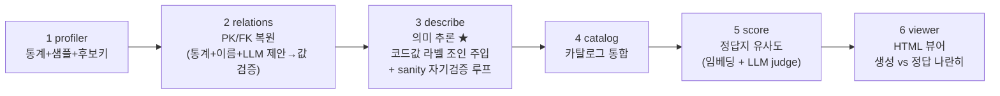

# db2doc **v2** — 문서 없는 DB의 의미를 복원해 카탈로그로

> 📘 **상세 기술 가이드: [`GUIDE.md`](GUIDE.md)** — 인용 논문·차용 내역, description 생성
> 메커니즘, 평가 방법, 온톨로지 레이어 구축/활용까지 전부 정리.

> v1(저장소 루트)과 **같은 메커니즘, 같은 샘플 DB(OMOP CDM 5.3 / GiBleed)**, 처음부터 다시 설계한 차세대 파이프라인.
> description을 전부 지운 DB에서 시스템이 테이블/컬럼 의미를 **유추**하고, **카탈로그**를 만들고,
> 공식 정답지와 **유사도를 측정**해 보여준다. v1은 그대로 보존, v2는 이 폴더에 독립적으로 존재한다.

---

## 파이프라인 (6단계)



실행 — 두 가지 방법:

```bash
cd v2

# (A) 웹 앱: 런 목록 홈 + 새 DB 연결 + 상세 결과 페이지
../.venv/bin/uvicorn webapp:app --port 8200
# -> http://localhost:8200  (첫 페이지에서 DB 연결 → 분석 시작 → 런 클릭해 결과 확인)

# (B) CLI: 루트 .env의 RDS/Bedrock 설정으로 단일 실행
../.venv/bin/python run.py            # 전체
../.venv/bin/python run.py --from 3   # 3단계부터 재개
../.venv/bin/python run.py --skip-score  # 정답지 없는 DB (카탈로그만)
```

산출물(런별 `runs/<id>/` 또는 CLI는 `out/`): `catalog.json`(카탈로그),
`data_dictionary.md`, `comments.sql`, `erd.mmd`, `score.json`(채점),
`viewer.html`(정적 뷰어 — CLI 실행 시).

---

## v1 대비 무엇이 다른가 (전부 v1 실측 약점에서 출발)

| # | v2 메커니즘 | v1의 약점 | 근거 |
|---|---|---|---|
| 1 | **단일 집계 쿼리 프로파일링** — 컬럼당 3쿼리 → 테이블당 1쿼리 | 스캔 ~9분 | (운영 개선) |
| 2 | **full-table 정확 유일성 검증 + 복합키 후보** — 샘플 1000행이 아니라 전체 테이블에서 distinct 확인 | 샘플상 unique인 가짜 PK(`drug_exposure` 중복행) | HoPF [3] |
| 3 | **FK 3-소스 결합**: 통계(포함관계) + 이름 + **LLM 제안 → 값 검증** | FK recall 0.47 (빈 테이블) | DBAutoDoc [1], LLM-FK [2] |
| 4 | **역할 접두사 해석** (`preceding_*`, `*_parent_*` → self-FK), 위치 접미사 정규화 (`*_id_1`) | self-FK 전부 누락 | — |
| 5 | **코드값 라벨 해석(resolve)**: 복원된 FK로 lookup 테이블을 **실제 JOIN**해 코드→라벨 쌍을 프롬프트에 주입 | "8507이 뭔지 모름" (검수로 미룸) | Cocoon [6], v1 C3 |
| 6 | **증거 원장(evidence ledger) + 신뢰도 보정**: 데이터 없는 컬럼은 conf 강등·플래그 | 빈 테이블 conf 0.92 과신 | 자기수정 한계 [7] |
| 7 | **생성→sanity검증→재생성 루프**: 의존성 그룹별 모순 탐지, 걸린 테이블만 이슈를 줘서 1회 재생성 | 검증이 conf 강등뿐, 재생성 없음 | CoVe [8], CRITIC [9] |
| 8 | **카탈로그 산출물**: 설명+키+통계+증거를 컬럼 단위 구조화 레코드로 | 산출물이 md/sql 텍스트뿐 | Spider 2.0 [10], BIRD [11] |
| 9 | **채점에 calibration 리포트**: conf≥0.7 vs <0.7 의 judge 정확도 분리 | conf가 못 믿을 숫자 | LLM-judge 베스트 프랙티스 [12] |
| 10 | **자원 가드레일**: 런 전체 토큰/호출 하드리밋 | 무제한 | DBAutoDoc 구현 [1] |

설계 제약: **근거 없는 self-review는 하지 않는다.** 모든 수정 단계(LLM FK 제안, sanity 재생성)는
외부 증거(값 포함관계, 명시적 모순 리포트)로 게이트한다 — "LLM은 외부 피드백 없이 자기 추론을
고치지 못한다"는 ICLR 2024 결과 [7]를 설계 원칙으로 채택.

---

## 결과 (GiBleed, 37 테이블, 정답지: OMOP 공식 데이터 딕셔너리)

| 지표 | v1 baseline | v1 개선 후 | **v2** |
|---|---|---|---|
| PK F1 | 0.667 | 0.912 | **0.963** (recall **1.0**) |
| FK F1 | 0.394 | 0.619 | **0.972** (recall **1.0**, 정답 157개 전부 복원) |
| 컬럼 설명 의미 일치 (LLM judge, n=275) | 0.931 | 0.938 | **0.964** (영문) / **0.942** (한글화 후) |
| 테이블 설명 의미 일치 (n=37) | 1.00 | 1.00 | **1.00** |
| S_overall | 0.687 | 0.840 | **0.979** |
| LLM 비용 (describe, in/out 토큰) | — | ~82k/30k | 217k/38k (검증 루프 포함) |

**한글화**: 추론 설명과 정답지를 모두 한국어로 운영한다 (식별자·코드·도메인 약어는 원문 유지).
- `translate.py truth` — OMOP 정답 CSV → `truth/*_ko.csv` (1회, score.py가 자동 우선 사용)
- `translate.py run` — 기존 런의 descriptions/concepts 번역 (영문 원본은 `*_en` 필드로 보존)
- 신규 런은 describe/concepts 프롬프트가 **처음부터 한국어로 생성** (번역 단계 불필요)
- 한글화 후 채점은 한↔한 비교: judge 0.942 (영문 0.964 대비 -2.2pp는 번역 경유 손실,
  네이티브 한국어 생성 런에서 재측정 예정). PK/FK·관계 지표는 언어와 무관해 동일.

calibration 리포트(신뢰도가 믿을 만한 숫자인지): conf≥0.7 컬럼의 judge 정확도 0.948,
conf<0.7은 0.983 — 낮은 신뢰도 항목이 실제로는 보수적 플래그(빈 테이블 등)이며,
v1에서 문제였던 "검증 불가인데 과신"은 사라짐.

> 측정 조건은 v1과 동일: FK/PK 제약·주석을 전부 제거한 DB에서 복원 → 공식 정답지와 대조.
> v2의 점프가 나온 곳 (각각 v1 오류 사례를 직접 잡은 것):
> - **PK**: full-table 유일성 검증이 "샘플 1000행에서만 unique"였던 가짜 PK(`drug_exposure` 등
>   중복행 보유 테이블)를 제거 + 데이터 있는 테이블의 name-fallback 금지.
> - **FK**: 역할 접두사/접미사 해석(`preceding_*`, `*_parent_*`, `*_id_1`)으로 self-FK 복원 +
>   varchar 키 허용(`concept_class_id` 등) + LLM 제안→값 검증.
> - **컬럼 설명**: 코드값을 복원된 FK로 실제 JOIN해 라벨 주입("8507=MALE") + "의미 우선,
>   데이터셋 상태는 부가 노트" 프롬프트 규칙 (demo 데이터의 'entirely null'을 정의처럼 쓰던
>   오류 제거).

---

## 참조 연구 (전부 초록 페이지를 fetch해 실재 확인)

핵심 차용:

1. **DBAutoDoc** — Nagarajan & Altman, *Automated Discovery and Documentation of Undocumented
   Database Schemas via Statistical Analysis and Iterative LLM Refinement*, 2026,
   arXiv:2603.23050. 오픈소스 구현 [MemberJunction/MJ](https://github.com/MemberJunction/MJ)
   `packages/DBAutoDoc/` (MIT). — 통계 PK/FK 점수화·게이트, 프롬프트 가드레일, 자원 가드레일.
2. **LLM-FK** — Tang, Zhang, Cai, Wang, *Multi-Agent LLM Reasoning for Foreign Key Detection
   in Large-Scale Complex Databases*, 2026, arXiv:2603.07278. — "통계가 못 보는 FK를 LLM이
   제안하고 검증 패스가 거른다"는 v2 FK 3-소스 구조의 직접 근거 (F1 93%+).
3. **HoPF** — Jiang & Naumann, *Holistic Primary Key and Foreign Key Detection*, JIIS 2019,
   DOI:10.1007/s10844-019-00562-z. — PK/FK를 분리하지 않고 전역 정합으로 선택하는 관점.
4. **Gao & Luo (Alibaba)**, *Automatic Database Description Generation for Text-to-SQL*,
   2025, arXiv:2502.20657. — coarse-to-fine + fine-to-coarse 이중 패스 설명 생성; "자동 생성
   설명 = 인간 설명 효과의 37%"라는 정직한 벤치마크.
5. **AutoDDG** — Zhang et al. (NYU), *Automated Dataset Description Generation using LLMs*,
   2025, arXiv:2502.01050. — profile-then-describe; reference-free 평가 트랙.
6. **Cocoon** — Huang & Wu (Columbia), *Semantic Table Profiling Using LLMs*, 2024,
   arXiv:2404.12552. — 의미 가설을 먼저 세우고 통계를 그 관점에서 해석.
7. **Huang et al.**, *Large Language Models Cannot Self-Correct Reasoning Yet*, ICLR 2024,
   arXiv:2310.01798. — 근거 없는 self-review 금지라는 v2 설계 제약의 근거.
8. **CoVe** — Dhuliawala et al. (Meta), *Chain-of-Verification Reduces Hallucination*,
   ACL Findings 2024, arXiv:2309.11495. — 독립 컨텍스트 검증 후 수정(sanity 루프의 형태).
9. **CRITIC** — Gou et al., *LLMs Can Self-Correct with Tool-Interactive Critiquing*,
   ICLR 2024, arXiv:2305.11738. — "주장→검사 가능한 프로브→판정" 패턴 (FK 값 검증이 그 사례).
10. **Spider 2.0** — Lei et al., ICLR 2025 (Oral), arXiv:2411.07763. — 엔터프라이즈 규모에서
    메타데이터 부재가 지배적 실패 요인(91.2%→21.3%): 카탈로그의 존재 근거.
11. **BIRD** — Li et al., NeurIPS 2023, arXiv:2305.03111. — 스키마 설명(external knowledge)이
    text2sql 정확도를 +13~20pt 올린다: 카탈로그 가치의 정량 근거.
12. **LLM-as-judge** — Zheng et al. (MT-Bench), NeurIPS 2023, arXiv:2306.05685;
    G-Eval, EMNLP 2023, arXiv:2303.16634. — 채점기의 reference-guided 판정 설계.

보조 참고: Doduo (SIGMOD 2022, arXiv:2104.01785) — 테이블 단위 일괄 컬럼 주석,
Zhang et al. (PVLDB 2010, DOI:10.14778/1920841.1920944) — 다중 컬럼 FK·랜덤니스 테스트,
Wretblad et al. 2024 (arXiv:2408.04691) — LLM 생성 컬럼 설명이 인간 gold보다 하류 text2sql에
유효할 수 있음(장황 허용의 근거), SelfCheckGPT (EMNLP 2023, arXiv:2303.08896) ·
Semantic Entropy (Nature 2024, DOI:10.1038/s41586-024-07421-0) — 샘플 일관성 기반 신뢰도
(로드맵), CHESS (arXiv:2405.16755) · Pneuma (SIGMOD 2025, arXiv:2504.09207) — 카탈로그를
검색 인덱스로 소비하는 패턴(로드맵).

---

## 폴더 구조

```
v2/
  config.py     # env/RDS/Bedrock + 토큰 가드레일 + IO (V2_OUT_DIR로 런별 출력)
  profiler.py   # 1. 통계 프로파일 (단일 집계쿼리, full-table 키 검증, enum 분포)
  relations.py  # 2. PK/FK 복원 (통계+이름+LLM제안→값검증, 게이트 G1-G6)
  describe.py   # 3. 의미 추론 (코드값 라벨 조인 주입, sanity 자기검증 루프, 증거 보정)
  catalog.py    # 4. 카탈로그 (catalog.json + data dictionary + COMMENT SQL + ERD)
  score.py      # 5. 정답지 유사도 (임베딩 cosine + LLM judge + calibration 리포트)
  graph.py      # 7. 스키마 그래프: 카탈로그 → AWS Neptune Analytics (openCypher 적재)
  ui.py         #    상세 페이지 템플릿 (트리 카탈로그 + 생성vs정답, viewer/webapp 공용)
  graph_ui.py   #    그래프 시각화 페이지 (vis-network, 조인 경로 하이라이트)
  viewer.py     # 6. 정적 HTML 뷰어 (단일 파일, 서버 불필요)
  webapp.py     #    FastAPI 웹 앱: 런 목록 홈 + 새 DB 연결 + 상세 + /runs/<id>/graph
  run.py        # 전체 실행 (--skip-score: 정답지 없는 DB)
  out/          # CLI 산출물 (gitignore)
  runs/         # 웹 앱 런별 산출물 + meta.json (gitignore)
```

웹 앱 구조: 홈(`/`)에서 ① 기존 런 리스트(상태·카탈로그 규모·judge/F1 점수·점수 출처 표시,
클릭하면 `/runs/<id>` 상세로) ② 새 DB 연결 폼(연결 테스트 → 분석 시작, 백그라운드로 파이프라인
실행, 5초마다 자동 갱신). 임의 고객 DB는 정답지가 없으므로 기본은 **카탈로그만** 생성하고,
OMOP 평가용 DB만 "정답지 채점 포함"을 켜서 유사도 점수까지 만든다. 비밀번호는 실행 프로세스
환경변수로만 전달되고 디스크(meta.json)에는 저장하지 않는다.

---

## 스키마 그래프 (AWS Neptune Analytics + openCypher) — text2sql 기반

생성된 카탈로그를 **속성 그래프**로 Neptune Analytics에 적재하고(`graph.py`),
웹앱 `/runs/<id>/graph`에서 시각화한다. text2sql의 스키마 링킹/조인 계획 기반이 되는
구조(스키마를 typed-relation 그래프로 인코딩 — RAT-SQL ACL 2020, arXiv:1911.04942;
온톨로지/제약 그래프 위 경로로 조인 구성 — ATHENA VLDB 2016).

모델링 근거(추가 검증): `(:Table)-[:HAS_COLUMN]->(:Column)` + `(:Column)-[:REFERENCES]->(:Column)`
패턴은 사실상의 표준이고(Neo4j 공식 text2sql 시맨틱 레이어 블로그·neocarta, OpenAI Cookbook
SchemaFlow), **복원 출처(provenance)·confidence를 엣지 프로퍼티로 싣는 것**은 Neo4j
dbxcarta의 LLM-추론 FK 패턴과 동일. 파생 Table→Table 엣지는 RAT-SQL의
`FOREIGN-KEY-TAB-*` 관계가 학술적 선례. FK 그래프 최단경로로 FROM/JOIN을 복원하는 것은
ValueNet(ICDE 2021, Dijkstra)·Microsoft UniSAr(`nx.shortest_path`)·SteinerSQL(EMNLP 2025,
Steiner tree)이 실제 코드로 쓰는 방식이다.

그래프 모델:
```
(:Database)-[:HAS_TABLE]->(:Table {name, description, rowcount, pk})
(:Table)-[:HAS_COLUMN]->(:Column {id, name, type, is_pk, description, confidence, examples})
(:Column)-[:REFERENCES {source, confidence}]->(:Column)   # 복원된 FK (컬럼 레벨)
(:Table)-[:JOINS_TO {via, source, confidence}]->(:Table)  # 파생: 조인 경로 계획 레이어
```
설명문(description)을 노드 프로퍼티로 저장 → 이후 Neptune Analytics **벡터 인덱스**
(그래프 생성 시점에만 설정 가능, 1~65,535차원)에 임베딩을 얹으면 "질문 → 벡터 검색으로
관련 테이블 → 그래프 탐색으로 조인 경로 확장"까지 단일 엔진으로 처리 가능 (로드맵).

사용:
```bash
export NEPTUNE_GRAPH_ID=...           # 없으면 graph.py create 로 생성 (16 m-NCU, public)
../.venv/bin/python graph.py create   # ~3분, IAM SigV4 public endpoint
V2_OUT_DIR=runs/<id> ../.venv/bin/python graph.py load    # 카탈로그 적재 (멱등 MERGE)
../.venv/bin/python graph.py status   # 노드/엣지 수
../.venv/bin/python graph.py delete   # 과금 중지 (스냅샷 없이 삭제)
```

### 개념 레이어 (온톨로지) — `concepts.py`

스키마 그래프 위에 **비즈니스 개념 층**을 얹는다 (ATHENA VLDB 2016 방식: 자연어 용어 →
개념 → 스키마로 내려가는 2단계 매칭). LLM이 카탈로그 설명에서 개념을 추출하되, 존재하는
테이블/컬럼만 참조하도록 검증(grounding)한다 — 미존재 참조는 제거·보고.

```
(:Concept {name, name_ko, description, synonyms, confidence})
(:Concept)-[:IS_A]->(:Concept)                  # 도메인 계층 (예: 처방 IS_A 임상 이벤트)
(:Concept)-[:MAPPED_TO {confidence}]->(:Table)
(:Concept)-[:MAPPED_TO {confidence}]->(:Column) # 핵심 컬럼
```

```bash
V2_OUT_DIR=runs/<id> ../.venv/bin/python concepts.py all   # extract(LLM) + load(Neptune)
```

OMOP 런 실측: 개념 39개(환자/방문/임상 이벤트/어휘 등), IS_A 15개
(예: Condition/Drug/Measurement → Clinical Event), 테이블 매핑 37개.
그래프 페이지의 **"개념 레이어" 토글**로 호박색 다이아몬드 노드로 표시되고,
**개념 검색**(예: "환자", "처방")이 동의어까지 매칭해 해당 개념을 포커스한다.
이것이 text2sql 스키마 링킹의 1단계(용어→개념→테이블)에 해당한다.

시각화 페이지(`/runs/<id>/graph`, vis-network v10):
- 테이블 노드(크기=행수, 회색=빈 테이블) + 방향성 FK 엣지(점선=이름/LLM 추정 출처)
- 노드 클릭 → 우측에 테이블 설명·컬럼·FK 상세
- **조인 경로 찾기**: 두 테이블 선택 → Neptune openCypher 가변길이 경로 질의
  (`MATCH p=(a)-[:JOINS_TO*1..5]-(b) ... ORDER BY size(vias)`) → k-최단 단순경로를
  그래프에 하이라이트 + **JOIN SQL 스켈레톤 자동 생성** (text2sql 플래너 입력 형태)
- Neptune 미설정/장애 시 카탈로그 기반 로컬 BFS로 자동 폴백 (페이지 상단에 출처 표시)

Neptune Analytics openCypher 주의(실측): `shortestPath()`/`reduce()` 기반 중복제거
미지원 → 길이순 over-fetch 후 서버측 파이썬에서 단순경로 필터. 리스트 프로퍼티 미지원 →
`examples`는 comma-join 문자열. 뮤테이션은 UNWIND 배치 MERGE로 멱등 적재.

비용(공식 Pricing API 실조회): 16 m-NCU(최소) = **$0.48/hr ≈ $11.5/일** (us-east-1).
replica 기본값이 1이라 `--replica-count 0` 미지정 시 2배($0.96/hr)가 되므로 주의 —
`graph.py create`는 0으로 고정해 둠. PoC 후 `graph.py delete`로 정리할 것.

Neptune Analytics 공식 문서로 확인된 추가 주의점:
- 라벨·프로퍼티·엣지가 전부 사라지면 vertex가 **암묵적으로 삭제**됨 → 모든 노드에
  불변 라벨(Database/Table/Column)을 부여하는 것이 공식 권장 (우리 모델은 충족).
- 엣지 custom `~id` 지정 불가(서버 할당, 재활용될 수 있음) → 엣지 식별은 프로퍼티(`via`)로.
- `reduce()`는 `+`/`*`만, `shortestPath()`/`allShortestPaths()` 미지원(대안:
  `CALL neptune.algo.*` 또는 길이순 over-fetch 후 앱에서 필터 — 우리 방식).
- 16 m-NCU = worker 4개(FIFO 큐) → 배치 적재는 직렬 전송이 안전 (우리 구현과 일치).

환경: 루트 `.env` 공유 (RDS PostgreSQL 16 + Bedrock Claude Opus 4.8 + Titan embed v2).
